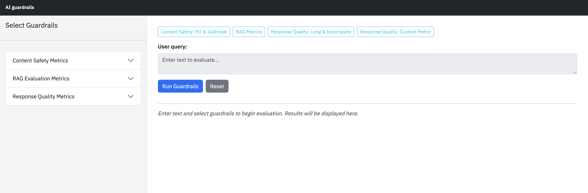

# AI guardrails

This repository demonstrates how to use the Watsonx Governance SDK to implement real-time guardrails for generative AI models. These guardrails help you instantly detect and control undesired behavior. For example, you may choose to block certain responses or guide the model toward a safer or more appropriate completion. **These highly customizable AI guardrails can be applied to both AI inputs** (evaluating and filtering user queries before they reach the model) **and AI outputs** (ensuring generated responses are checked before being returned to end users).

To showcase these capabilities, we provide a Dash-based web application that performs real-time evaluations for content safety, bias detection, RAG quality metrics, and more.

## Features

- **Content Safety Metrics:** HAP, PII Detection, Harm Detection, Violence, Profanity, Social Bias, Jailbreak Detection, Unethical Behavior, Sexual Content, Evasiveness

- **RAG Evaluation Metrics:** Answer Relevance, Context Relevance, Faithfulness

- **Response Quality Metrics (LLM as Judge and Custom Metrics):** Answer Completeness, Conciseness, Helpfulness, Action-Oriented Validator

- **Interactive Dashboard:** Select multiple guardrails, adjust risk thresholds, and view color-coded results

- **Export Results:** Download evaluation results as CSV files



### How to Use These Metrics to Block Undesired AI Behavior

You can block undesired AI behavior by configuring customizable thresholds for each metric.

For content safety metrics, you can set an upper-limit thresholds that determine when content becomes unsafe for your application. Each metric can have its own threshold. For example, if your use case is more sensitive to **Jailbreak** attempts than **HAP**, you can configure a lower upper-limit for the Jailbreak metric to make your guardrail more sensitive to those risks.

For RAG evaluation metrics (Answer Relevance, Context Relevance, Faithfulness), you can set the lower-limit thresholds to enforce quality standards. If a generated answer falls below the required score, you can block the output or trigger an alternative workflow (e.g., regeneration, human review).

For response quality metrics, you can use LLM as judge or define your rule based or code based custom metrica. For example, **Conciseness** uses LLM as judge to evaluate the agent's response in terms of conciseness. **Action-oriented validator**, on the other hand, is a custom rule-based custom metric that evlaute's the agent's response in terms of how action oriented it ia. These metrics can be used to block agent's response (output) or trigger an alternative workflow (e.g., regeneration, human review).

## Prerequisites

- Python 3.11 (not python 3.13)
- IBM watsonx.ai account with API credentials
- IBM watsonx.governance access

## Setup Instructions

### 1. Create Virtual Environment

```bash
python3.11 -m venv my-venv
```

### 2. Activate Virtual Environment

**MacOS/Linux:**

```bash
source venv/bin/activate
```

**Windows (CMD):**

```cmd
venv\Scripts\activate.bat
```

**Windows (PowerShell):**

```powershell
venv\Scripts\Activate.ps1
```

### 3. Install Dependencies

```bash
pip install -r requirements.txt
```

### 4. Configure Environment Variables

The `.env` file should already be present with your credentials. Verify it contains:

```env
## IBM watsonx.governance API Configuration
WATSONX_APIKEY=your_watsonx_api_key_here
WATSONX_URL=https://us-south.ml.cloud.ibm.com

## Service Instance ID (required if you have multiple instances)
WXG_SERVICE_INSTANCE_ID=your_service_instance_id_here

## Project ID for watsonx.governance
WXG_PROJECT_ID=your_project_id_here

## Optional: Region (default is us-south)
# WATSONX_REGION=us-south

## OpenAI API Key (if using OpenAI as LLM judge)
# OPENAI_API_KEY=your_openai_api_key_here
```

To get your credentials:

- **API Key**: [IBM Cloud Console](https://cloud.ibm.com/) > Manage > Access (IAM) > API keys
- **Service Instance ID**: Find in your watsonx.governance service details

### 5. Run the Application

```bash
python app.py
```

The app will start on `http://localhost:8050`

## Key Components

### Metrics Categories

**Content Safety**

- Detects harmful, biased, or inappropriate content
- Identifies security threats like jailbreak attempts
- Filters PII and sensitive information

**RAG Evaluation**

- Assesses quality of retrieval-augmented generation
- Measures relevance and faithfulness
- Validates context usage

**Response Quality Metrics**

- Evaluates the completeness of the agent's response
- Evaluates the conciseness of the agent's response
- Evaluates the helpfulness of the agent's response
- Evaluates whether the agent's response is action oriented

## Troubleshooting

**Issue: "Failed to initialize evaluator"**

- Check your `.env` file contains valid credentials
- Verify API key has necessary permissions
- Ensure service instance ID is correct

**Issue: Dependencies installation fails**

- Ensure you're using Python 3.11+
- Try upgrading pip: `pip install --upgrade pip`
- Install dependencies one at a time to identify issues
