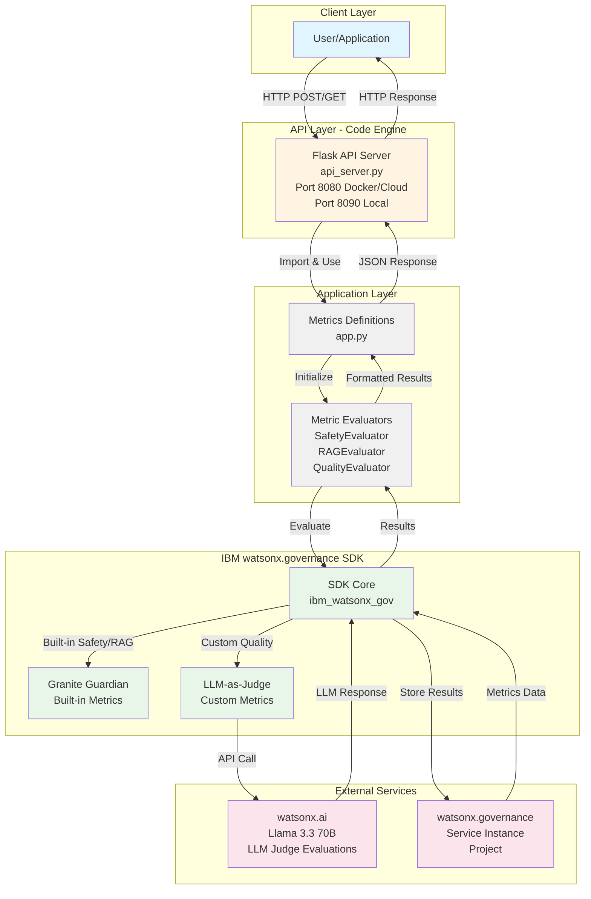
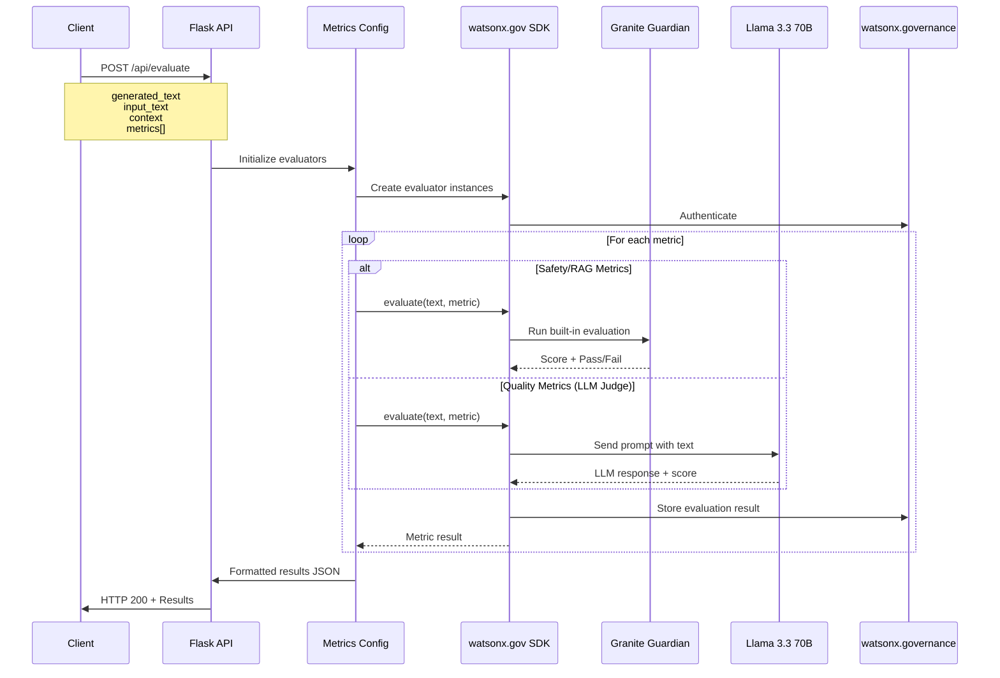
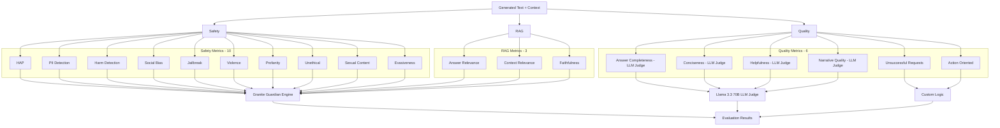

# AI Guardrails Application - Data Flow Diagram

## Main Data Flow

```mermaid
graph TB
    subgraph "Client Layer"
        A[User/Application]
    end

    subgraph "API Layer - Code Engine"
        B[Flask API Server<br/>api_server.py<br/>Port 8080 Docker/Cloud<br/>Port 8090 Local]
    end

    subgraph "Application Layer"
        C[Metrics Definitions<br/>app.py]
        D[Metric Evaluators<br/>SafetyEvaluator<br/>RAGEvaluator<br/>QualityEvaluator]
    end

    subgraph "IBM watsonx.governance SDK"
        E[SDK Core<br/>ibm_watsonx_gov]
        F1[Granite Guardian<br/>Built-in Metrics]
        F2[LLM-as-Judge<br/>Custom Metrics]
    end

    subgraph "External Services"
        G1[watsonx.ai<br/>Llama 3.3 70B<br/>LLM Judge Evaluations]
        G2[watsonx.governance<br/>Service Instance<br/>Project]
    end

    A -->|HTTP POST/GET| B
    B -->|Import & Use| C
    C -->|Initialize| D
    D -->|Evaluate| E
    E -->|Built-in Safety/RAG| F1
    E -->|Custom Quality| F2
    F2 -->|API Call| G1
    E -->|Store Results| G2
    G1 -->|LLM Response| E
    G2 -->|Metrics Data| E
    E -->|Results| D
    D -->|Formatted Results| C
    C -->|JSON Response| B
    B -->|HTTP Response| A

    style A fill:#e1f5ff
    style B fill:#fff4e1
    style C fill:#f0f0f0
    style D fill:#f0f0f0
    style E fill:#e8f5e9
    style F1 fill:#e8f5e9
    style F2 fill:#e8f5e9
    style G1 fill:#fce4ec
    style G2 fill:#fce4ec
```

## Request Sequence Flow

```mermaid
sequenceDiagram
    participant Client
    participant API as Flask API
    participant Metrics as Metrics Config
    participant SDK as watsonx.gov SDK
    participant Granite as Granite Guardian
    participant LLM as Llama 3.3 70B
    participant WXG as watsonx.governance

    Client->>API: POST /api/evaluate
    Note over Client,API: generated_text<br/>input_text<br/>context<br/>metrics[]

    API->>Metrics: Initialize evaluators
    Metrics->>SDK: Create evaluator instances
    SDK->>WXG: Authenticate

    loop For each metric
        alt Safety/RAG Metrics
            Metrics->>SDK: evaluate(text, metric)
            SDK->>Granite: Run built-in evaluation
            Granite-->>SDK: Score + Pass/Fail
        else Quality Metrics (LLM Judge)
            Metrics->>SDK: evaluate(text, metric)
            SDK->>LLM: Send prompt with text
            LLM-->>SDK: LLM response + score
        end
        SDK->>WXG: Store evaluation result
        SDK-->>Metrics: Metric result
    end

    Metrics->>API: Formatted results JSON
    API->>Client: HTTP 200 + Results
```

## Available Metrics (19 Total)

```mermaid
graph TB
    Input[Generated Text + Context] --> Safety & RAG & Quality

    subgraph "Safety Metrics - 10"
        S1[HAP]
        S2[PII Detection]
        S3[Harm Detection]
        S4[Social Bias]
        S5[Jailbreak]
        S6[Violence]
        S7[Profanity]
        S8[Unethical]
        S9[Sexual Content]
        S10[Evasiveness]
    end

    subgraph "RAG Metrics - 3"
        R1[Answer Relevance]
        R2[Context Relevance]
        R3[Faithfulness]
    end

    subgraph "Quality Metrics - 6"
        Q1[Unsuccessful Requests]
        Q2[Answer Completeness - LLM Judge]
        Q3[Conciseness - LLM Judge]
        Q4[Helpfulness - LLM Judge]
        Q5[Narrative Quality - LLM Judge]
        Q6[Action Oriented]
    end

    Safety --> S1 & S2 & S3 & S4 & S5 & S6 & S7 & S8 & S9 & S10
    RAG --> R1 & R2 & R3
    Quality --> Q1 & Q2 & Q3 & Q4 & Q5 & Q6

    S1 & S2 & S3 & S4 & S5 & S6 & S7 & S8 & S9 & S10 --> GG[Granite Guardian Engine]
    R1 & R2 & R3 --> GG
    Q2 & Q3 & Q4 & Q5 --> LLM[Llama 3.3 70B LLM Judge]
    Q1 & Q6 --> Custom[Custom Logic]

    GG --> Results[Evaluation Results]
    LLM --> Results
    Custom --> Results
```
