# Setup Presto

## Introduction
- Presto, or Presto database (PrestoDB), is an open-source, distributed SQL query engine that can query large data sets from different data sources, enabling enterprises to address data problems at scale. [official docs][https://www.ibm.com/think/topics/presto]
- Presto is used as the datalake house in this case, to dump the data after Datastage transform its.

## Prerequisities
- wastonx.data SaaS [instance][https://techzone.ibm.com/my/reservations/create/685acc0400ecf8562ca48ebc]

## Setup 

1. Navigate to IBM Cloud. Click on the hamburger menu in the top left. Select **Resource List**

    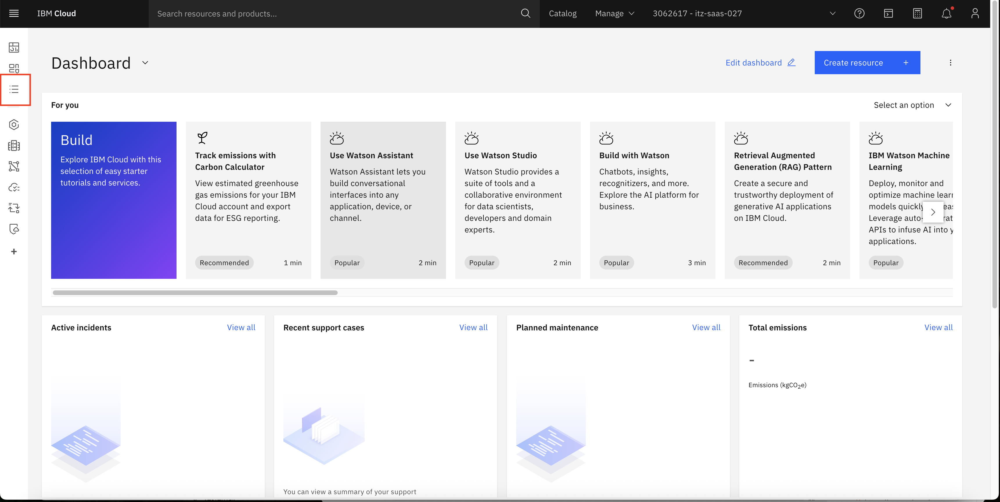

2. This will show you a list of available resources in your instance. Select **Databases**, which will give you a list of products. Choose the **watsonx.data** product.
    
    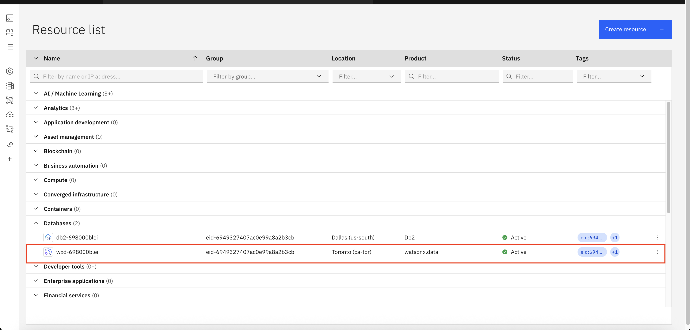

3. If this is the first time you're logging in, you will see the following screen, keep all the settings default as mentioned and click **Next**
    
    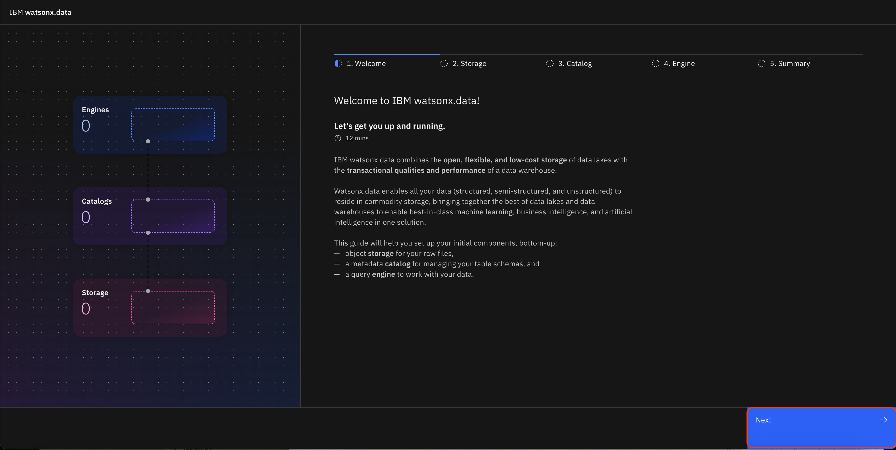

    Keep clicking next until you see the following screen, wait for 15 mins until the resources are being set up.
    
    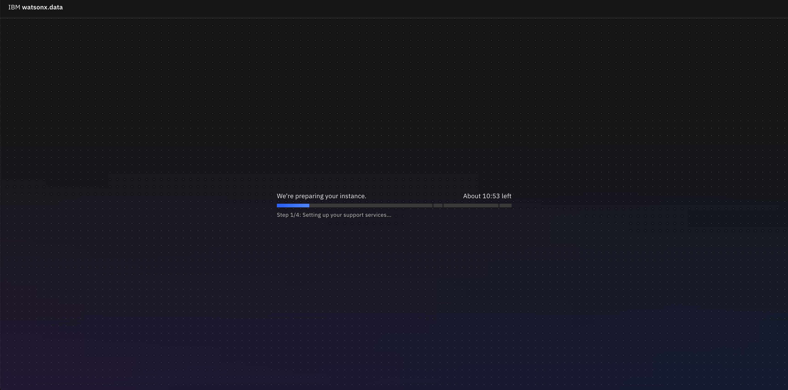

4. Once the resources are setup, you will see this screenn
    
     

5. Navigate to the **Infrastructure Manager** 
    
    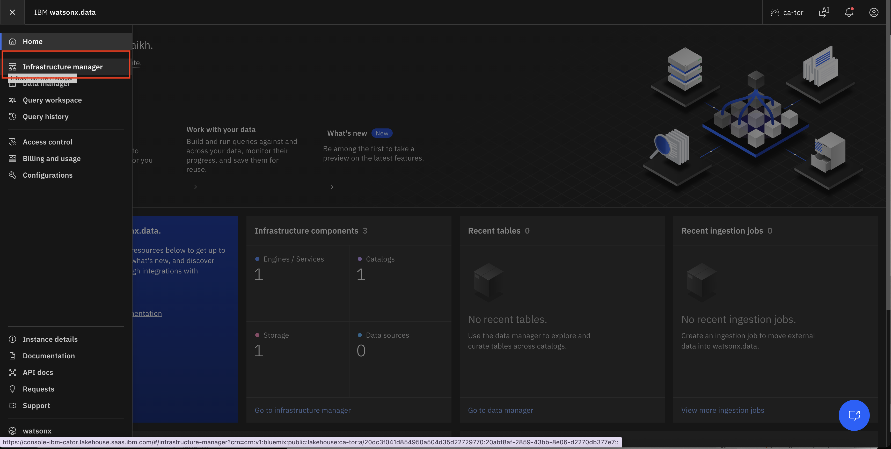

6. You should see the following resources, **Presto**, **Iceberg** and **Cos**, click on the Presto Engine to configure access control and copy connection details.

    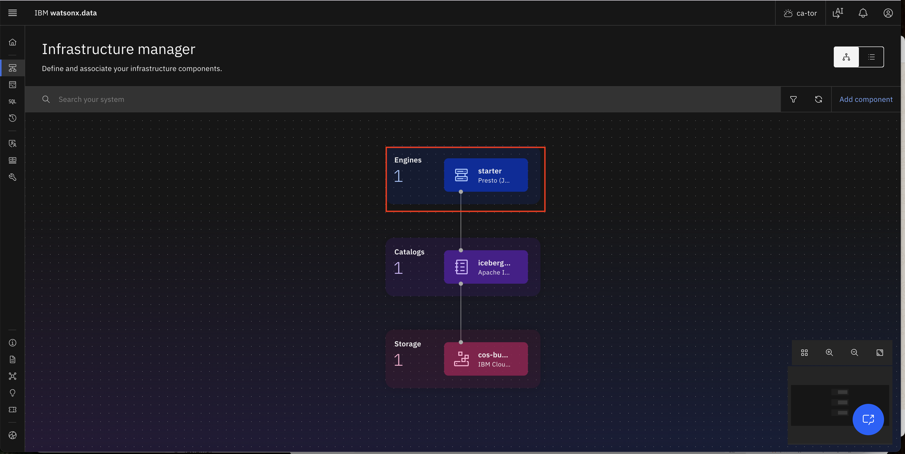

7. Once in Presto, click on the **Access Control** tab to configure access for the service instance

    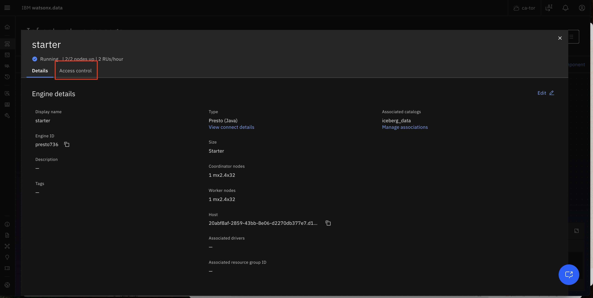

8. Click on **Add Access+**

    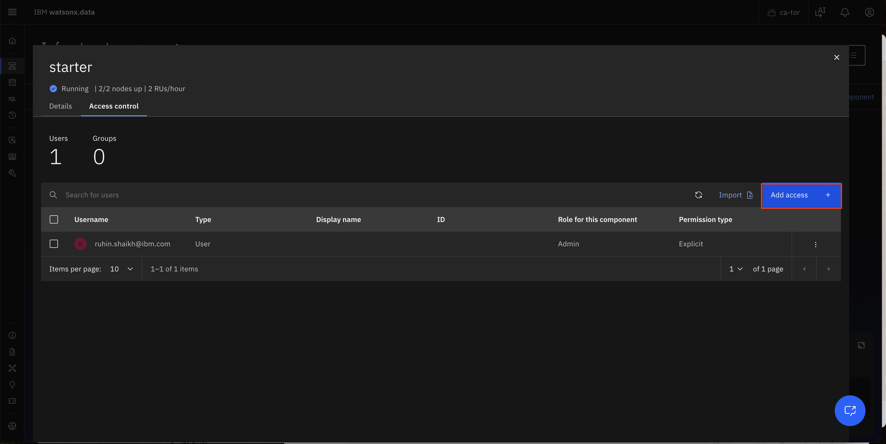

9. Scroll to find the Access Group, and select **Admin** role and then click on Add
    
    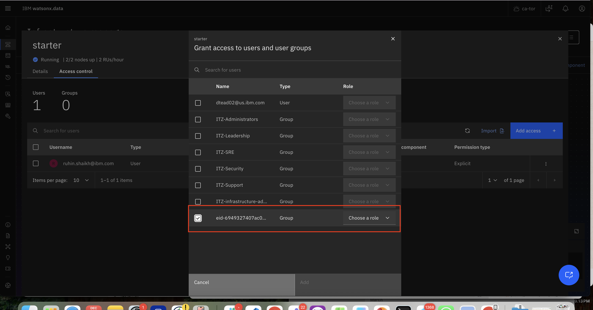

10. Now go back to the Details tab and click on **View connect details**

    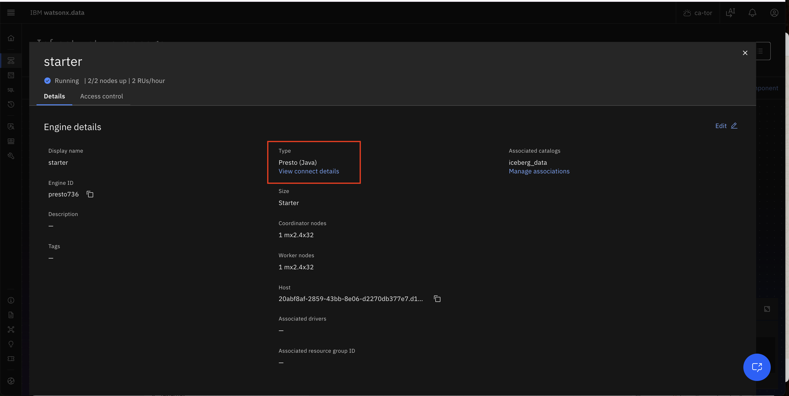

11. Select the **Copy Json Snippet** and save it locally, we will use this later to setup in Datastae

    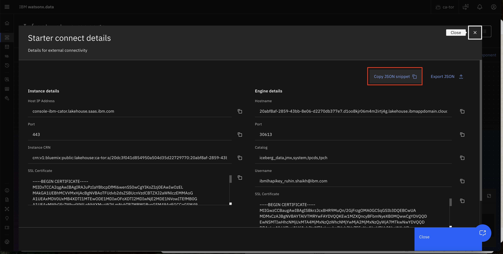

12. Now, on the left plane, select the **Access Control** . You will see all the resources, select the **cos** resource

    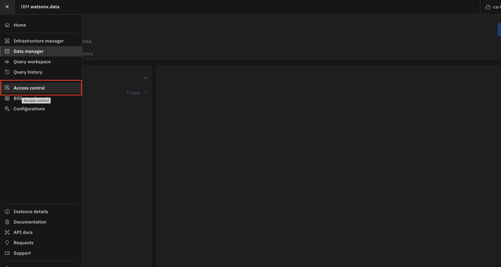

    Click on **Add Access+**
    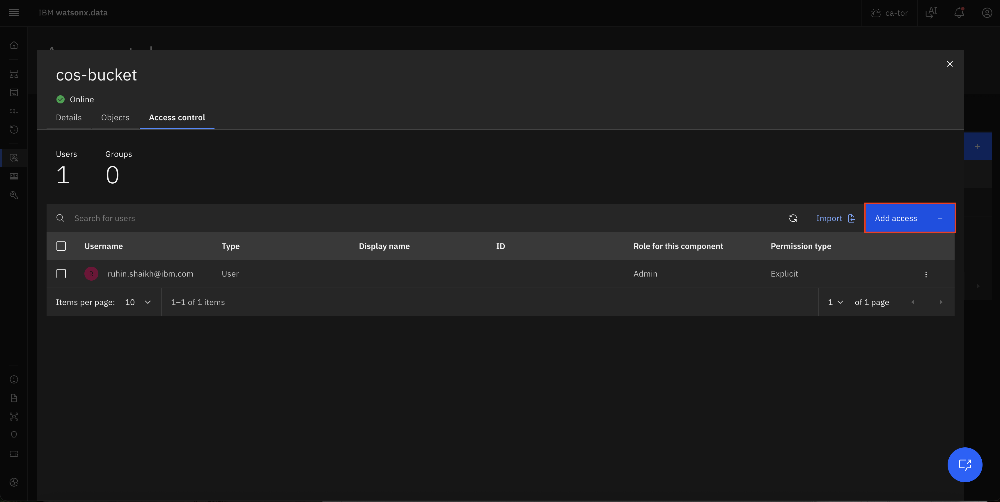

13. Scroll to find the Access Group, and select **Writer** role and then click on **Add**

     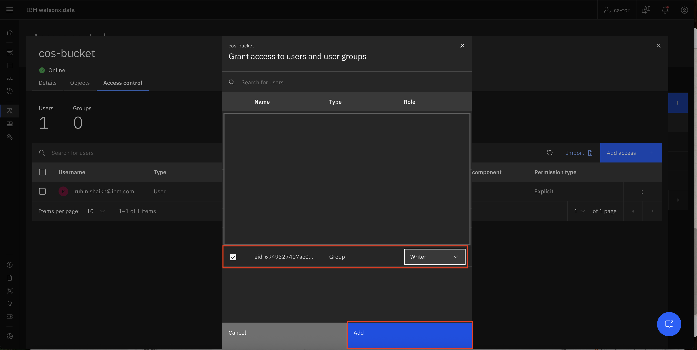

14. Click on **Data Manger** in the left plane

    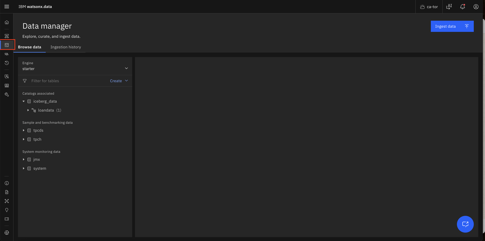

15. Click on **Create** --> **Create schema**

    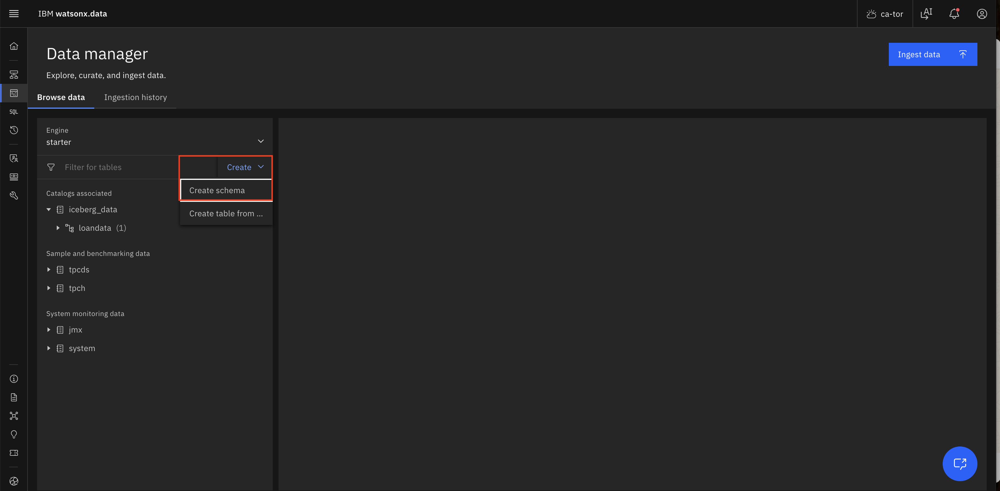

16. Name the schema, type  `loandata2` and click on **create**

    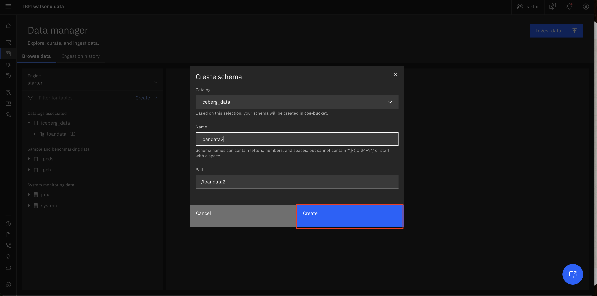

You have now setup Presto Engine, we will now start setting up Datastage.

## Next steps:
- Setup and run Datastage

