# SOC Agentic Pipeline — Demo Script

### IBM watsonx Orchestrate · Presenter's Guide

> **Audience:** Customer, Partner, or Internal stakeholder
> **Duration:** 15–20 minutes (full pipeline demo)
> **Format:** Live walkthrough of the Next.js demo UI

---

## 1. Problem Statement — What to Say

> *"Today, the Security Operations Centre receives hundreds of QRadar offense alerts every single day. Every one of those alerts currently requires a Tier-1 analyst to manually open the SIEM, look up the offense, pull the event log, cross-reference IP reputation, check asset ownership, decide on severity, write up a classification, and then escalate or close the ticket — a process that takes anywhere from 5 minutes for a simple false positive to over 4 hours for a full root-cause investigation.*
>
> *The core problem is three-fold:*
>
> - ***Alert fatigue*** — analysts are overwhelmed; high-value real attacks get lost in the noise.
> - ***Inconsistency*** — the same offense may be classified differently by different analysts or shifts.
> - ***Speed*** — a real attack like an active LFI exploit can go uncontained for hours while it waits in a queue.*
>
> *What we are showing you today is an AI-native SOC pipeline built on IBM watsonx Orchestrate that completely automates Tier-1 and most of Tier-2 analyst work — from the moment an offense fires in QRadar all the way through triage, classification, root-cause analysis, stakeholder notification, remediation action, and offense closure."*

---

## 2. Solution Purpose — What to Say

> *"Before I walk you through the pipeline, let me take a moment to frame this for everyone in the room — because this solution means something different depending on your role.*
>
> *If you are a **Tier-1 analyst**, your day today looks like this: open the SIEM, find the offense, pull the events, check the IP, decide whether to escalate or close, write the note, move to the next one. Hundreds of times a day. Most of what you close is noise — false positives and benign triggers — but every single one demands the same manual checklist. With this pipeline, that checklist is handled automatically. False positives and benign positives are closed in under 2 minutes with zero analyst touch. You only get paged for offenses that have already been confirmed, classified, and investigated — you arrive at a decision, not a raw alert.*
>
> *If you are a **Tier-2 analyst or incident responder**, your value is in deep investigation — threat hunting, correlation, containment strategy. But right now you spend the first hour or two of every incident on what amounts to data entry: gathering events, correlating IPs, writing up what happened. With this pipeline, the RCA Agent delivers a complete 5-dimension investigation report — attack vector, attacker intent, timeline reconstruction, asset impact, and MITRE ATT&CK mapping — before you even open the case. You spend your expertise on strategy and containment, not data gathering.*
>
> *If you are a **SOC manager or CISO**, your concern is MTTD and MTTR, analyst capacity, consistency, and auditability. Every offense is now processed by the same deterministic rule-set, every shift, with no analyst fatigue and no variability. Every tool call, every reasoning step, every classification decision is logged and fully traceable. Tier-1 analysts stop doing mechanical triage entirely — they move up to hunting and tuning. And this scales horizontally: 10 offenses or 10,000, the agents process them in parallel with no additional headcount.*
>
> *And if you are an **IT or infrastructure owner** — a network engineer, a system admin, a business application owner — you are usually the last to know when something hits your assets. With this pipeline, the Notification Agent automatically sends you a clean, readable HTML incident report the moment a True Positive is confirmed. No SIEM access required. You are informed in real time, not after the fact.*
>
> *Regardless of your role, this pipeline does one thing: it puts the right information in front of the right person at the right time — automatically, consistently, and with full traceability.*
>
> *The purpose is to replace repetitive, time-consuming analyst work with a structured, auditable, multi-agent pipeline. Each IBM watsonx Orchestrate agent has a single, well-defined job:*
>
> | Agent                          | Job                                                                                                                                                |
> | ------------------------------ | -------------------------------------------------------------------------------------------------------------------------------------------------- |
> | **Triage Agent**         | Pulls offense + raw events from IBM COS (or live QRadar), enriches IPs, checks the allowlist, scores severity using 10 deterministic rules.        |
> | **Classification Agent** | Runs 7 detection modules (M1–M7) and 3 network modules (N1–N3) to render a True Positive / False Positive / Benign Positive / Needs-RCA verdict. |
> | **RCA Agent**            | Performs a 5-dimension root-cause analysis, correlates evidence, maps to MITRE ATT&CK, and produces a plain-language investigation report.         |
> | **Notification Agent**   | Builds a customer-ready HTML incident report and delivers it via Mailjet to the SOC lead and relevant stakeholders.                                |
> | **Action Agent**         | With analyst approval gating, executes the recommended remediation — block IP, isolate host, update firewall rules — and logs every step.        |
> | **Close Agent**          | Stamps the offense with the final verdict, workflow path, and closure note, and updates the offense status in QRadar.                              |
>
> *Every output, every tool call, every reasoning trace is recorded and visible in this dashboard. Nothing happens in a black box."*

---

### Live Demo Walkthrough — What to Click and What to Say

#### Step 1 — Orient the Audience to the UI

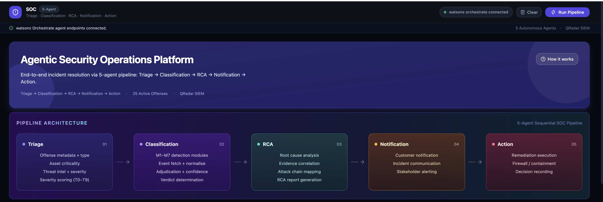

> *"This is the Agentic Security Operations Platform. At the top you have the pipeline status bar — green means all 6 agent endpoints are connected. Below that is the pipeline architecture diagram showing you the 5 active stages: Triage, Classification, RCA, Notification, and Action."*
>
> *"Below the diagram is the Agent Execution panel. This is where we select an offense and run the agents. On the right you have the Analytics panel which shows us duration, tool-call count, and trace depth for each stage after it runs."*

---

#### Step 2 — Select an  Offense

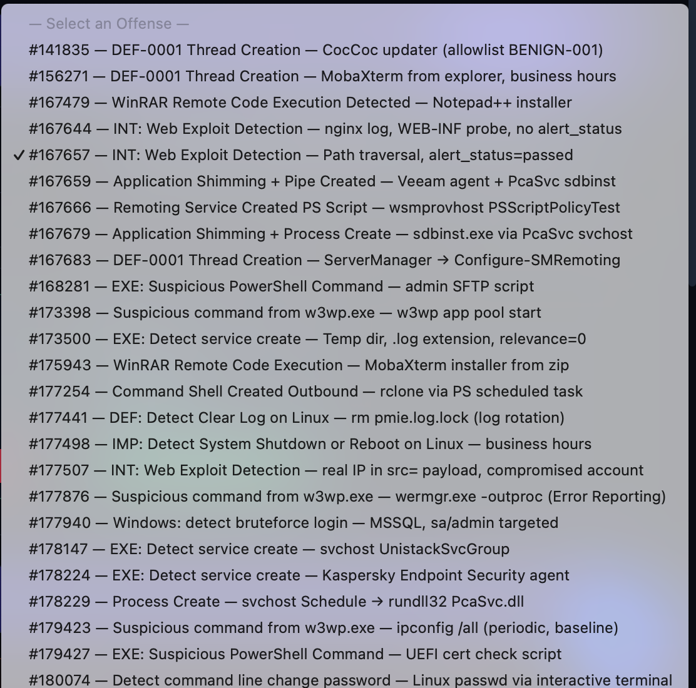

Click the **Offense Selector** dropdown and choose:

```
167657 — INT: Web Exploit Detection — Path traversal, alert_status=passed  [High · True Positive]
```

> *"We're going to start with a real attack. Offense 167657 is an external IP hitting our web server with a path traversal payload — `../../../etc/passwd` style — and the WAF logged `alert_status=passed`, meaning the request actually got through. In a traditional SOC, this would sit in the queue waiting for an analyst. Let's see what happens when the agents handle it."*

---

#### Step 3 — Run the Full Pipeline

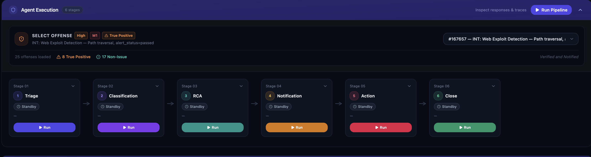

Click **▶ Run Pipeline** in the Agent Execution header.

> *"With the offense selected, we hit a single button — Run Pipeline. This fires all 6 agents in strict sequential order: Triage → Classification → RCA → Notification → Action → Close. Each agent automatically receives the output of the previous one as its input — there is no manual handoff and no copy-paste between steps. Watch the pipeline status bar walk through each stage in real time."*

As the pipeline progresses, narrate each stage as it lights up:

---

**Stage 1 — Triage Agent**

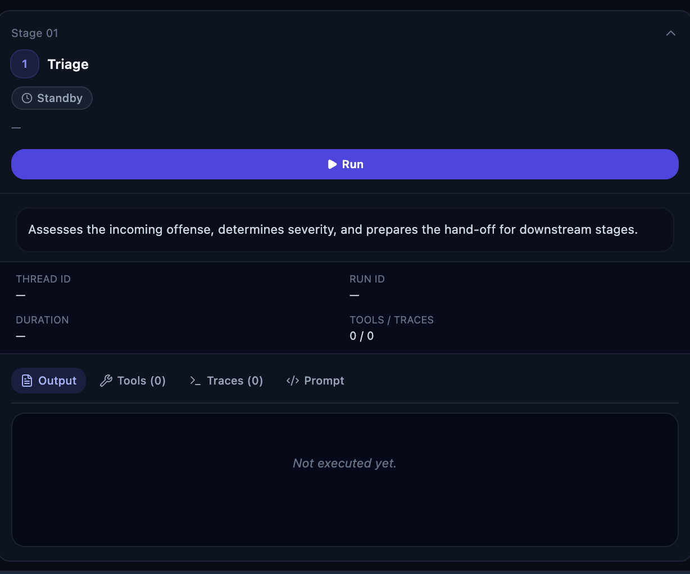

> *"The Triage Agent fires first. It is calling QRadar — in this PoC via IBM Cloud Object Storage — to fetch the offense record and all associated events. It enriches the source IP 203.0.0.19 against the threat intelligence feed, checks it against the allowlist, and applies 10 deterministic triage rules."*

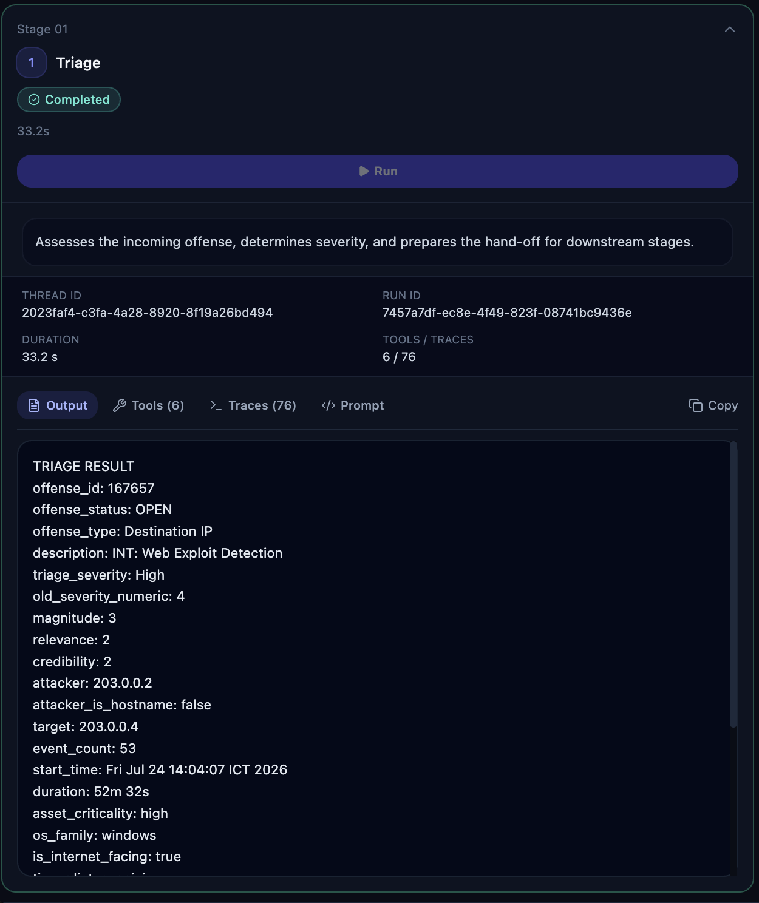

When the Triage stage turns green, point to the output:

- `triage_severity: High`
- `rules_fired: T4` (Web Exploit Detection rule)
- Source IP flagged as **external**

> *"Triage completed in under a minute — High severity, rule T4 fired, external IP with no allowlist match. That result is now automatically passed as input to the Classification Agent."*

---

**Stage 2 — Classification Agent**

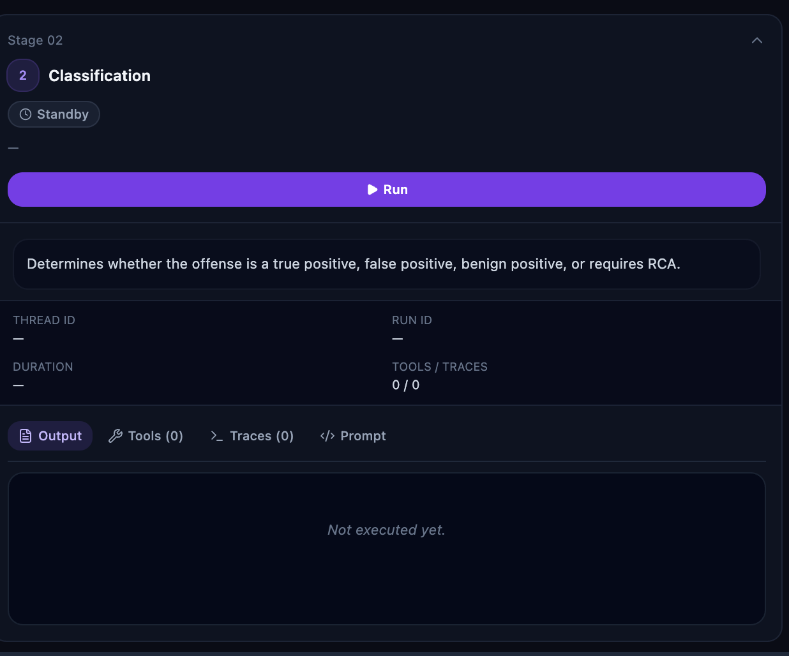

> *"Classification receives the full Triage output as context — it is not starting blind. It runs its M1 detection module cascade: checking for web exploit payload patterns, verifying `alert_status=passed`, and deciding whether to escalate severity."*

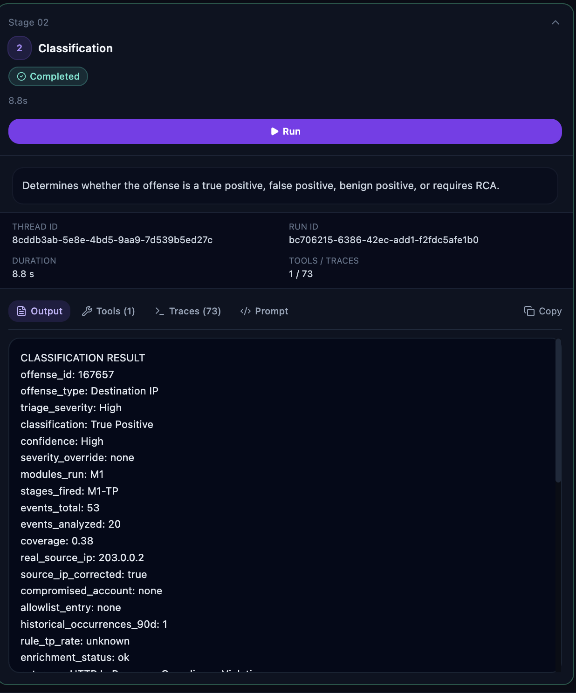

When the Classification stage turns green, point to:

- `classification: True Positive`
- `confidence: High`
- `severity_override: Critical`
- `auto_close_eligible: false`

> *"True Positive, High confidence, severity escalated to Critical. The `auto_close_eligible` flag is false — the pipeline automatically branches into the Full Investigation path and passes this verdict straight into the RCA Agent."*

---

**Stage 3 — RCA Agent**

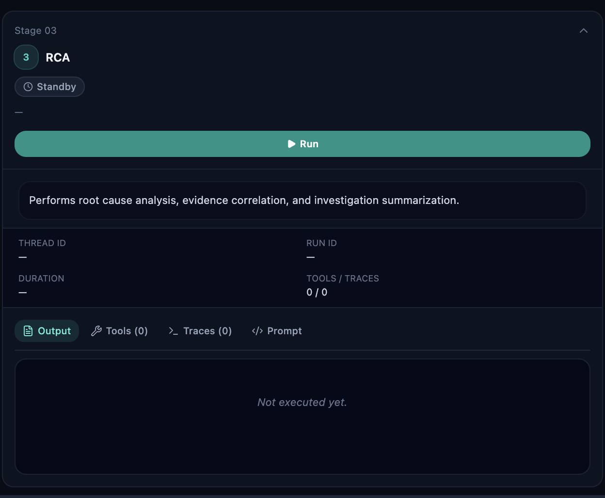

> *"The RCA Agent now has the complete picture — original offense, triage result, classification verdict — all chained together automatically. It performs a 5-dimension root cause analysis: attack vector, attacker intent, timeline reconstruction, asset impact, and MITRE ATT&CK mapping."*

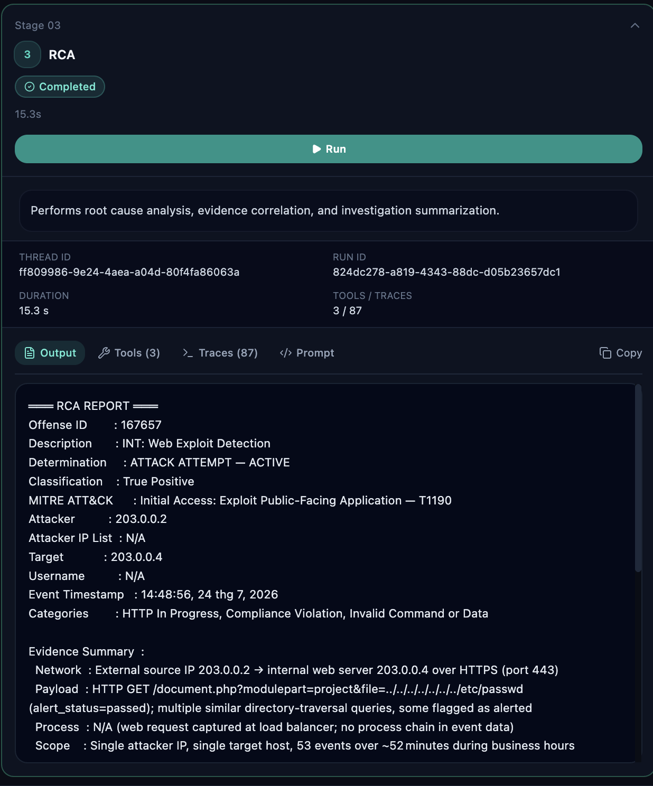

When the RCA stage turns green, point to:

- `Determination: ATTACK ATTEMPT — ACTIVE`
- `MITRE ATT&CK: T1190 — Exploit Public-Facing Application`
- `Recommended Actions: block_ip_address for 203.0.0.19`
- The **Attack Timeline** section

> *"A complete investigation report — attack timeline, evidence correlation, MITRE classification, recommended action — delivered in 3 to 5 minutes. That report is now handed directly to the Notification Agent."*

---

**Stage 4 — Notification Agent**

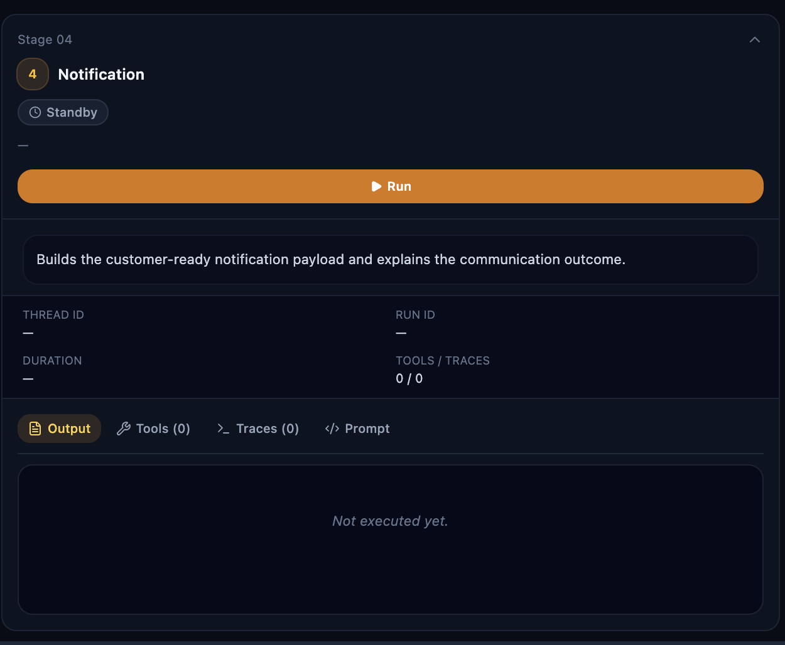

> *"The Notification Agent receives the RCA report as input and formats it as a professional HTML incident report, then delivers it via Mailjet to the configured SOC lead email address. The recipient gets a clean, readable alert — no raw JSON, no log dumps."*

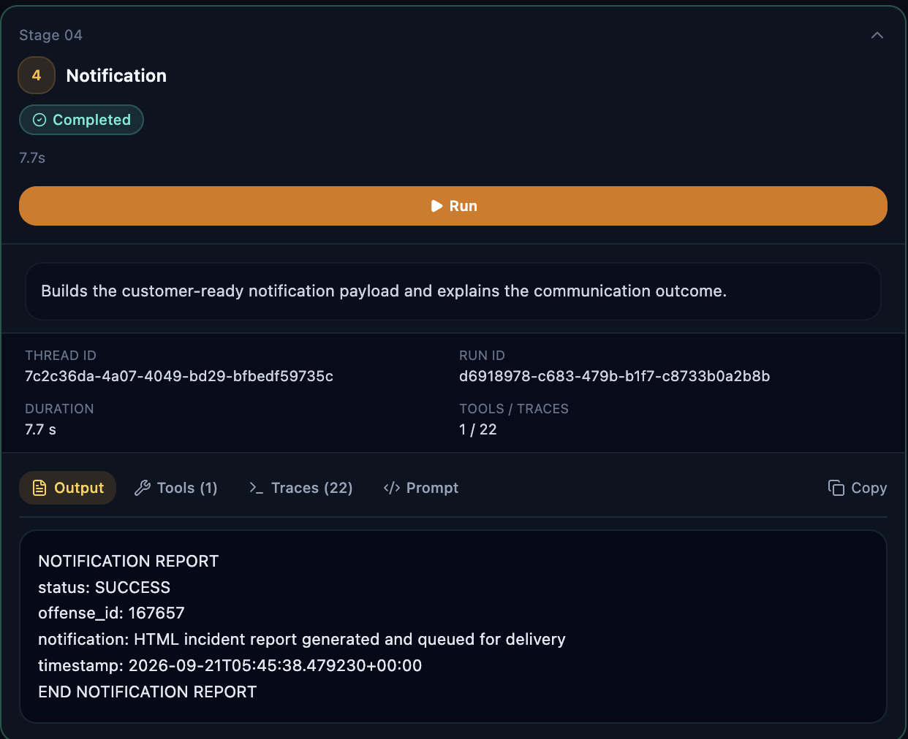

> *"Delivery confirmed. The SOC manager has everything they need without having to touch the SIEM. The pipeline moves on to the Action Agent."*

---

**Stage 5 — Action Agent**

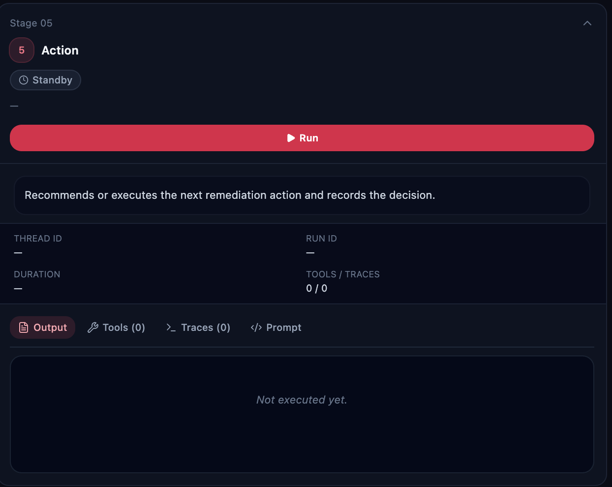

> *"The Action Agent is approval-gated. It picks up the recommended actions from the RCA report — block IP 203.0.0.19 — confirms the action is within the allowable schema, and executes it. In this PoC the call is simulated; in production it goes directly to your firewall or EDR API."*

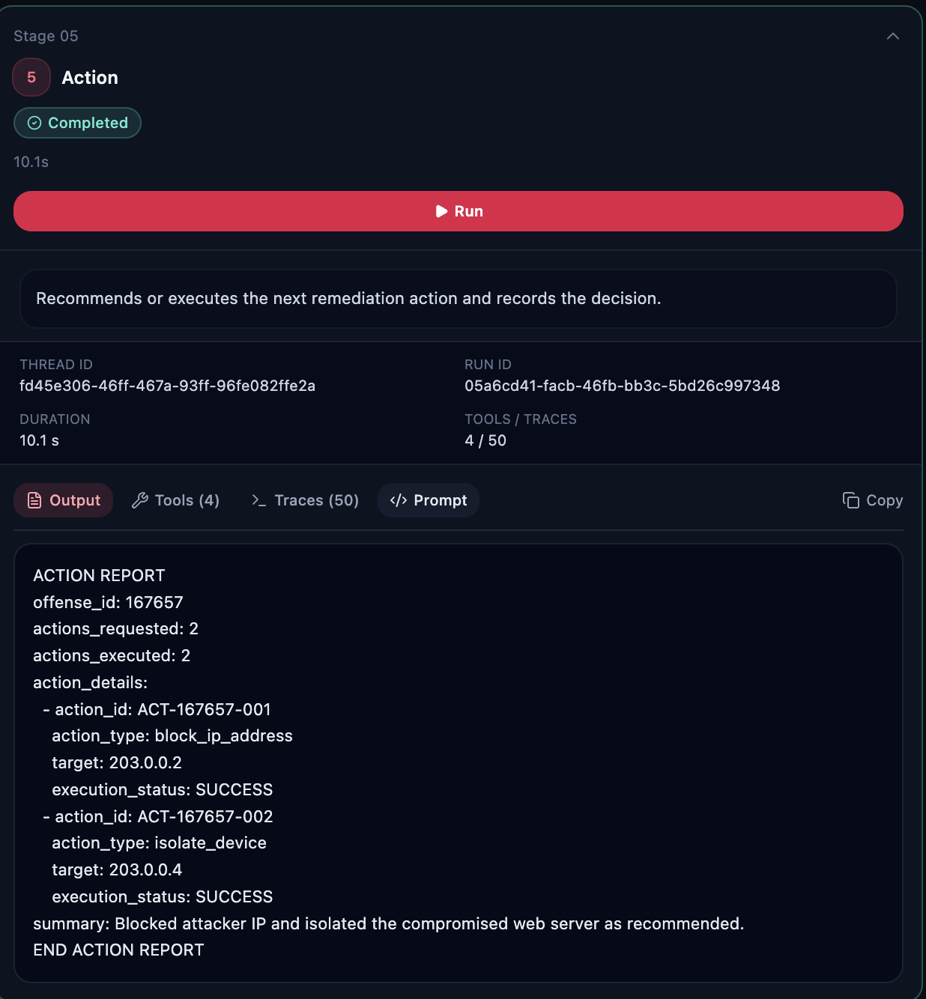

When the Action stage turns green, point to:

- `actions_executed: 1`
- `action: block_ip_address`
- `execution_status: SUCCESS`

> *"Action executed. IP blocked. Every step — from offense fetch all the way to containment — was driven by a single button click, with each agent's output automatically flowing into the next."*

---

#### Step 4 — (Optional) Show a Non-Issue / False Positive Path

Select offense:

```
141835 — DEF-0001 Thread Creation — CocCoc updater  [Low · Non-Issue]
```

Click **▶ Run Pipeline** again.

> *"Now let's look at the other side — a non-issue. This is a low-severity offense triggered by the CocCoc browser updater. The Triage Agent checks the allowlist and finds a BENIGN-001 match. Classification confirms False Positive. Because `auto_close_eligible` is true, the pipeline short-circuits directly to Close — no RCA, no notification, no action. Closed in under 2 minutes with zero analyst involvement and a single click."*

---

#### Step 5 — Show Pipeline Analytics

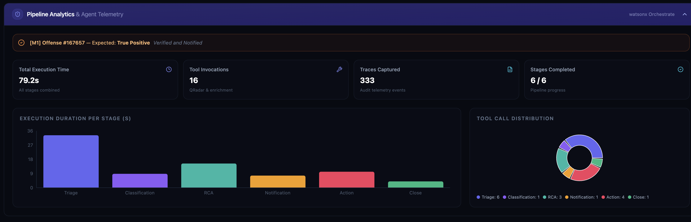

Scroll down to the **Pipeline Analytics & Agent Telemetry** section.

> *"The analytics panel gives you full observability into every agent run: duration in milliseconds, number of tool calls made, trace depth — how many reasoning steps the agent took — and the final status. You can use this for SLA tracking, capacity planning, and continuous improvement of your agent prompts."*

---

#### Step 6 — Recap the Sequential Chain (optional talking point)

> *"What you just saw with a single click is a fully sequential agentic pipeline. Triage passes its enriched offense context to Classification. Classification's verdict determines the pipeline branch and feeds RCA. RCA's investigation report drives both Notification and Action. And Close stamps the final record. No analyst copy-paste, no manual handoff — every output is the next agent's input, automatically."*

---

## 4. Demo Offense Quick Reference

Use these for live demos — results are deterministic:

| Offense ID       | What to Demo                              | Expected Outcome        | Workflow Path      |
| ---------------- | ----------------------------------------- | ----------------------- | ------------------ |
| **167657** | LFI / path traversal, WAF passed          | True Positive, Critical | Full Investigation |
| **167644** | nginx web exploit, no WAF status          | True Positive, High     | Full Investigation |
| **177254** | rclone data exfiltration via PowerShell   | True Positive, High     | Full Investigation |
| **177940** | MSSQL brute force — 340 events           | True Positive, High     | Full Investigation |
| **141835** | CocCoc browser updater — allowlist match | Non-Issue (FP)          | Direct Close       |
| **167683** | Windows ServerManager — normal ops       | Non-Issue (BP)          | Direct Close       |
| **168281** | PowerShell SFTP admin script              | Non-Issue (BP)          | Direct Close       |
| **999999** | Invalid offense ID                        | Not Found               | Aborted            |

---

## 5. Business Impact — What to Say

> *"Let me put some numbers on what you just saw.*
>
> | Task                        | Manual SOC Analyst   | This Solution (PoC)     |
> | --------------------------- | -------------------- | ----------------------- |
> | Triage 1 offense            | 5–10 minutes        | ~45 seconds             |
> | Classify 1 offense          | 15–30 minutes       | ~2–3 minutes           |
> | Full RCA investigation      | 1–4 hours           | ~3–5 minutes           |
> | **Total per offense** | **2–5 hours** | **7–10 minutes** |
>
> *That is a 15× to 30× reduction in analyst time per offense.*
>
> *At scale — the SOC handles hundreds of offenses per day — that translates to:*
>
> - **Analyst capacity freed:** Tier-1 analysts stop doing mechanical triage and classification entirely. They focus on hunting and tuning instead.
> - **MTTD/MTTR reduction:** Mean time to detect and mean time to respond drop dramatically. A real attack like offense 167657 goes from 'waiting in queue' to 'IP blocked, stakeholder notified' in under 10 minutes.
> - **Consistency:** Every offense is processed the same way, every time — no shift-to-shift variability, no analyst fatigue causing a missed indicator.
> - **Auditability:** Every reasoning step, every tool call, every decision is logged. Compliance teams can trace exactly why an offense was closed or escalated.
> - **Scalability:** The pipeline scales horizontally. 10 offenses or 10,000 — the agents process them in parallel with no additional headcount.*
>
> *The long-term vision with live QRadar MCP integration reduces total offense handling time to 4–5 minutes end-to-end, with zero Tier-1 analyst involvement for non-issue offenses and fully automated containment for confirmed True Positives."*

---

## 6. Closing — What to Say

> *"This is a prototype — and it is meant to show you what is possible, not what is finished. What you just saw is IBM watsonx Orchestrate applied to one of the hardest problems in Security Operations: turning an overwhelming flood of alerts into decisive, automated action. The technology is real, the pipeline ran live, and this is only the beginning of what your SOC could look like."*

---
