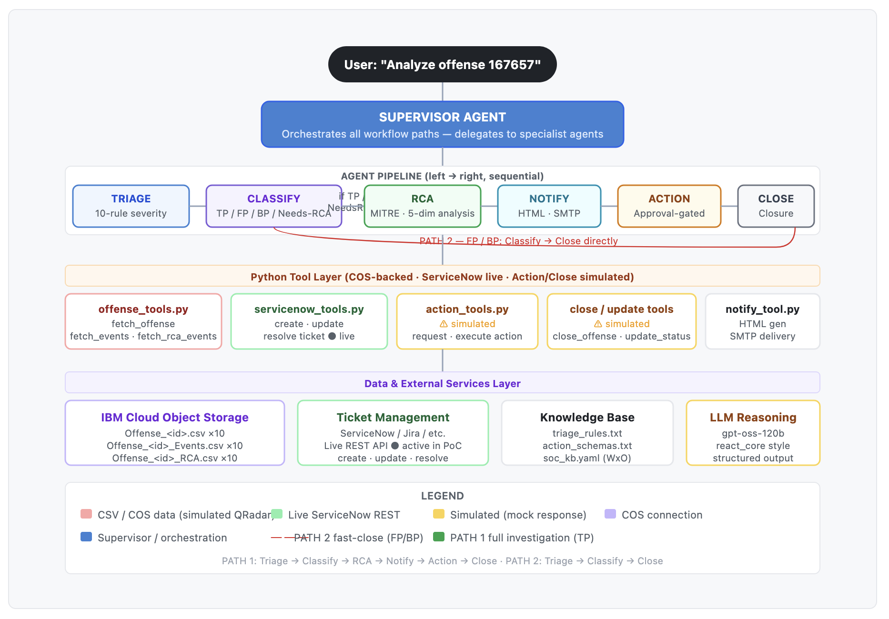

# Agentic SOC — QRadar Offense Automation

> **IBM watsonx Orchestrate** multi-agent pipeline powered by **BOB** that automates the full QRadar security offense response lifecycle — from triage through root cause analysis to remediation and closure.

---

## Table of Contents

1. [Project Overview](#project-overview)
2. [Architecture](#architecture)
3. [Prerequisites](#prerequisites)
4. [Project Structure](#project-structure)
5. [Step 1 — Configure Credentials](#step-1--configure-credentials)
6. [Step 2 — Upload Offense Data to IBM COS](#step-2--upload-offense-data-to-ibm-cos)
7. [Step 3 — Bootstrap WxO (import-all.sh)](#step-3--bootstrap-wxo-import-allsh)
8. [Step 4 — Retrieve Agent IDs from WxO](#step-4--retrieve-agent-ids-from-wxo)
9. [Step 5 — Configure the Web App (.env)](#step-5--configure-the-web-app-env)
10. [Step 6 — Run the Demo Web App](#step-6--run-the-demo-web-app)
11. [Agent Pipeline](#agent-pipeline)
12. [Test Scenarios](#test-scenarios)
13. [Demo Script](#demo-script)

---

## Project Overview

This PoC demonstrates how **IBM watsonx Orchestrate** agents automate the QRadar SOC offense response lifecycle, replacing repetitive Tier-1 and Tier-2 analyst work with a structured multi-agent pipeline.

| Item                   | Detail                                                                               |
| ---------------------- | ------------------------------------------------------------------------------------ |
| **Platform**     | IBM watsonx Orchestrate (WxO)                                                        |
| **Data**         | Sanitized QRadar offenses (CSV files in`SampleData/` and IBM Cloud Object Storage) |
| **LLM**          | `groq/openai/gpt-oss-120b` with `react_core` reasoning style                     |
| **Notification** | Mailjet (HTML incident email reports)                                                |
| **Frontend**     | Next.js 16 + Tailwind CSS                                                            |
| **Backend**      | Express.js (WxO runs API proxy)                                                      |

---

## Architecture

```
User prompt: "Analyze QRadar offense 167657"
        │
        ▼
  SUPERVISOR AGENT  (routes all workflow paths)
        │
        ├─── TRIAGE AGENT             (10-rule severity assignment)
        ├─── CLASSIFICATION AGENT     (TP / FP / BP / Needs-RCA)
        ├─── RCA AGENT                (5-dim analysis + MITRE ATT&CK)
        ├─── NOTIFY AGENT             (HTML email via Mailjet)
        ├─── ACTION AGENT             (approval-gated remediation)
        └─── CLOSE AGENT              (offense closure)
```

Architecture diagrams are in [`Architecture/`](Architecture/):




## Prerequisites

| Requirement                      | Minimum Version / Notes                                                              |
| -------------------------------- | ------------------------------------------------------------------------------------ |
| Node.js                          | 18+                                                                                  |
| Python                           | 3.11+                                                                                |
| IBM watsonx Orchestrate instance | instance URL and an IBM Cloud API key                                                |
| IBM Cloud Object Storage bucket  | Offense CSV files and YAML config files must be uploaded before the pipeline can run |
| Mailjet account                  | For HTML incident report delivery; requires API key + secret key                     |

---

## Project Structure

```
Agentic_SOC/
├── SOC-APP/                        # All agent, tool, and app code
│   ├── agents/                     # WxO agent YAML definitions
│   │   ├── conversational_supervisor_agent.yaml # Active conversational supervisor
│   │   ├── triage_agent.yaml
│   │   ├── classification_agent.yaml
│   │   ├── rca_agent.yaml
│   │   ├── notify_agent.yaml
│   │   ├── action_agent.yaml
│   │   └── close_agent.yaml
│   ├── tools/                      # Python tool definitions (imported into WxO)
│   │   ├── offense_tools.py        # fetch_offense, fetch_offense_events, fetch_rca_events
│   │   ├── enrichment_tools.py     # 13 enrichment tools (rule stats, asset, TI, etc.)
│   │   ├── action_tools.py         # Approval-gated remediation
│   │   ├── close_offense_tool.py   # Offense closure simulation
│   │   ├── notify_tool.py          # HTML report + Mailjet delivery
│   │   ├── update_offense_status.py # Severity update simulation
│   │   └── requirements.txt        # pydantic, requests, mailjet-rest, pyyaml
│   ├── connections/                # WxO connection specs
│   │   ├── cos_connection.yaml     # IBM COS key_value connection
│   │   └── mailjet_connection.yaml # Mailjet API connection
│   ├── knowledge_base/             # WxO knowledge base files
│   │   ├── soc_kb.yaml             # Knowledge base manifest
│   │   ├── triage_rules.txt        # Triage scoring rules
│   │   └── action_schemas.txt      # Action schemas (used by action_agent)
│   ├── config/                     # YAML config files uploaded to COS at runtime
│   │   ├── allowlist.yaml
│   │   ├── service_path_policy.yaml
│   │   ├── exfil_tools.yaml
│   │   ├── proxy_and_lb.yaml
│   │   ├── privileged_accounts.yaml
│   │   ├── linux_log_rotation.yaml
│   │   ├── maintenance_windows.yaml  # ⚠️  Populate with your maintenance schedule
│   │   ├── asset_registry.yaml       # ⚠️  Provide your CMDB export
│   │   └── threat_intel_feed.yaml    # ⚠️  Provide your TI feed
│   ├── src/                        # Next.js frontend source
│   ├── server/server.js            # Express backend (WxO API proxy — port 3001)
│   ├── import-all.sh               # One-shot WxO bootstrap script
│   ├── workspace_config.yaml       # WxO workspace folder paths
│   ├── package.json                # Node.js dependencies
│   └── .env.example                # Environment variable template
├── SampleData/                     # Sanitized QRadar offense datasets
│   ├── RCA_Expected_Output.xlsx    # Expected RCA outputs for validation
│   └── sanitized/                  # Per-offense CSV files
│       ├── Offense_<id>.csv              # Offense metadata
│       ├── Offense_<id>_Events.csv       # Associated events
│       └── Offense_<id>_RCA_Relevant_Events.csv  # RCA-filtered events (where present)
├── Architecture/                   # Architecture diagrams
│   ├── cos_agentic_soc.png
│   ├── qradar_agentic_soc.png
│   └── workflow_path.png
├── images/                         # Demo UI screenshots (used in DEMO_SCRIPT.md)
└── DEMO_SCRIPT.md                  # Presenter's guide for live customer demos
```

---

## Step 1 — Configure Credentials

**All credentials are stored exclusively in `SOC-APP/.env`.** The bootstrap script (`import-all.sh`) and the web app (`server/server.js`) both read from this single file — there is nothing to edit inside the scripts themselves.

### Create `SOC-APP/.env`

```bash
cd SOC-APP
cp .env.example .env
```

Then open `.env` and fill in every value. The full set of variables:

| Variable               | Required by                              | Description                                                              |
| ---------------------- | ---------------------------------------- | ------------------------------------------------------------------------ |
| `WXO_ENV_NAME`       | `import-all.sh`                        | Any short label for the WxO environment (e.g.`soc_dev`)                |
| `WXO_URL`            | `import-all.sh` + `server/server.js` | `https://api.<region>.watson-orchestrate.cloud.ibm.com/instances/<ID>` |
| `WXO_API_KEY`        | `import-all.sh` + `server/server.js` | IBM Cloud API key with WxO Manager role                                  |
| `COS_API_KEY`        | `import-all.sh`                        | IBM COS API key                                                          |
| `COS_INSTANCE_CRN`   | `import-all.sh`                        | `crn:v1:bluemix:public:cloud-object-storage:global:a/<acct>:<inst>::`  |
| `COS_ENDPOINT`       | `import-all.sh`                        | `https://s3.<region>.cloud-object-storage.appdomain.cloud`             |
| `COS_BUCKET`         | `import-all.sh`                        | Name of your COS bucket                                                  |
| `MAILJET_API_KEY`    | `import-all.sh`                        | Mailjet API key                                                          |
| `MAILJET_SECRET_KEY` | `import-all.sh`                        | Mailjet secret key                                                       |

> Agent ID variables (`TRIAGE_AGENT_ID`, `CLASSIFICATION_AGENT_ID`, etc.) can be left blank for now — fill them in after Step 4.

---

## Step 2 — Upload Offense Data to IBM COS

The pipeline tools read offense CSV files and YAML config files from IBM Cloud Object Storage at runtime. These must be in the COS bucket before the agents can process any offense.

### 2a. Upload offense CSV files

Upload all files from `SampleData/sanitized/` to the root of your COS bucket. You can use the IBM Cloud console, the `ibmcloud cos` CLI.

### 2b. Upload YAML config files (optional first run)

The config YAML files in `SOC-APP/config/` are read by the enrichment tools. Upload all files from `SOC-APP/config/` to the root of your COS bucket. You can use the IBM Cloud console, the `ibmcloud cos` CLI.

**Before uploading, review these three files — they are currently placeholders and need live data:**

| File                         | What to populate                                         |
| ---------------------------- | -------------------------------------------------------- |
| `maintenance_windows.yaml` | Your environment's planned maintenance schedule          |
| `asset_registry.yaml`      | CMDB / asset export for`lookup_asset` tool             |
| `threat_intel_feed.yaml`   | Threat intelligence feed for`lookup_threat_intel` tool |

---

## Step 3 — Bootstrap WxO (import-all.sh)

This single script creates the Python virtual environment, installs the WxO CLI, and imports all connections, tools, knowledge bases, and agents into your WxO instance.

```bash
cd SOC-APP
chmod +x import-all.sh
./import-all.sh
```

### What the script does

|     Step     | Phase             | Target Component          | Summary & Execution Details                                                                                                               |
| :----------: | :---------------- | :------------------------ | :---------------------------------------------------------------------------------------------------------------------------------------- |
| **1** | Setup Environment | `.venv` & Dependencies  | Initializes Python virtual environment and installs`ibm-watsonx-orchestrate` CLI, `pyyaml`, `requests`, and `ibm-cos-sdk`.        |
| **2** | Authentication    | WxO Environment           | Authenticates and activates the target WxO environment using`WXO_URL` and `WXO_API_KEY`.                                              |
| **3** | Data Connection   | IBM Cloud Object Storage  | Registers the COS connection asset (`soc-cos-data`) and sets active credentials.                                                        |
| **3b** | Notification      | Mailjet Service           | Registers the Mailjet connection (`soc-mailjet`) and configures API secrets.                                                            |
| **4** | Configuration     | Runtime Config Files      | Uploads YAML policy/lookup files to the COS bucket                                                                                        |
| **5** | Tools Import      | 6 Python Tool Modules     | Imports`offense_tools`, `enrichment_tools`, `update_offense_status`, `close_offense_tool`, `notify_tool`, and `action_tools`. |
| **6** | Knowledge Base    | SOC Knowledge Base        | Deploys`soc_knowledge_base` and pauses for vector indexing completion (25s).                                                            |
| **7** | Agents Import     | 6 Sub-agents + Supervisor | Deploys sub-agents (Triage, Classification, RCA, Notify, Action, Close) and binds collaborators to Supervisor.                            |

> **If any single tool or agent import fails**, the script prints a `⚠️` warning and continues — it will not abort. Check the console output for any warning lines and re-run the failed import manually:
>
> ```bash
> cd SOC-APP && source .venv/bin/activate
> orchestrate agents import -f agents/<failed_agent>.yaml
> # or
> orchestrate tools import -k python -f tools/<failed_tool>.py -r tools/requirements.txt [-a <app_id>]
> ```

---

## Step 4 — Retrieve Agent IDs from WxO

After a successful bootstrap, each imported agent has a UUID in WxO. The demo web app needs these IDs to call the correct agent at each pipeline stage.

1. Log in to the WxO UI at `https://<region>.watson-orchestrate.cloud.ibm.com/home` (e.g. `https://eu-de.watson-orchestrate.cloud.ibm.com/home`)
2. Navigate to **AI Agents** → each agent's detail page
3. Copy the UUID from the agent URL or the detail panel

You will need the IDs for:

| Agent YAML                               | `.env` Variable            |
| ---------------------------------------- | ---------------------------- |
| `triage_agent.yaml`                    | `TRIAGE_AGENT_ID`          |
| `classification_agent.yaml`            | `CLASSIFICATION_AGENT_ID`  |
| `rca_agent.yaml`                       | `RCA_AGENT_ID`             |
| `notify_agent.yaml`                    | `NOTIFICATION_AGENT_ID`    |
| `action_agent.yaml`                    | `ACTION_AGENT_ID`          |
| `close_agent.yaml`                     | `CLOSE_AGENT_ID`           |
| `conversational_supervisor_agent.yaml` | `CONV_SUPERVISOR_AGENT_ID` |

> **Fallback:** If you do not set these in `.env`, the server falls back to the hardcoded UUIDs baked into [`SOC-APP/server/server.js`](SOC-APP/server/server.js). Those are the IDs from the original development environment and **will not work** in a new WxO instance. Always set the correct IDs in `.env`.

---

## Step 5 — Configure the Web App (.env)

Open `SOC-APP/.env` and add the agent IDs retrieved in Step 4. `WXO_URL` and `WXO_API_KEY` are already set from Step 1 and are reused by the web app automatically — no extra variables needed.

```env
# WxO credentials (set in Step 1 — used by both import-all.sh and server/server.js)
WXO_ENV_NAME=<your_env_name>
WXO_URL=https://api.<region>.watson-orchestrate.cloud.ibm.com/instances/<INSTANCE_ID>
WXO_API_KEY=<your_ibm_cloud_api_key>

# Stage agent IDs (retrieved from WxO UI after import-all.sh)
TRIAGE_AGENT_ID=<uuid>
CLASSIFICATION_AGENT_ID=<uuid>
RCA_AGENT_ID=<uuid>
NOTIFICATION_AGENT_ID=<uuid>
ACTION_AGENT_ID=<uuid>
CLOSE_AGENT_ID=<uuid>

# Supervisor agent IDs
CONV_SUPERVISOR_AGENT_ID=<uuid>

# Optional
EXPRESS_PORT=3001
```

---

## Step 6 — Run the Demo Web App

### Install dependencies (first time only)

```bash
cd SOC-APP
npm install
```

### Start the app

```bash
npm run dev
```

This starts both servers simultaneously:

| Server            | URL                       | Purpose                                                     |
| ----------------- | ------------------------- | ----------------------------------------------------------- |
| Next.js UI        | `http://localhost:3000` | Demo dashboard (offense selector, pipeline flow, analytics) |
| Express API proxy | `http://localhost:3001` | Translates UI requests to WxO agent run API calls           |

> Any existing processes on ports 3000 and 3001 are killed automatically before startup.

### What the UI does

- **Run Pipeline** button fires all 6 agents in strict sequential order — Triage → Classification → RCA → Notify → Action → Close — passing each agent's output as input to the next
- Automatically branches workflow: True Positive / Needs-RCA offenses follow the Full Investigation path; False Positives and Benign Positives short-circuit directly to Close
- Displays each stage's live status and output as it completes
- Shows per-stage analytics from the run payload: status, duration, tool-call count, trace item count
- Stores prompts, outputs, run IDs, thread IDs, analytics, and trace payloads in browser `localStorage`

---

## Agent Pipeline

| Agent                     | YAML File                                | Role                                                             |
| ------------------------- | ---------------------------------------- | ---------------------------------------------------------------- |
| Conversational Supervisor | `conversational_supervisor_agent.yaml` | Conversational orchestrator — step-by-step with analyst gates   |
| Triage                    | `triage_agent.yaml`                    | 10-rule severity assignment                                      |
| Classification            | `classification_agent.yaml`            | 7 detection modules (M1–M7) → TP / FP / BP / Needs-RCA verdict |
| RCA                       | `rca_agent.yaml`                       | 5-dimension root cause analysis + MITRE ATT&CK mapping           |
| Notify                    | `notify_agent.yaml`                    | HTML incident report generation + Mailjet delivery               |
| Action                    | `action_agent.yaml`                    | Approval-gated remediation execution                             |
| Close                     | `close_agent.yaml`                     | Offense closure                                                  |

### Tool inventory

| Tool file                    | Tools exported                                                                                                                                                                                                                                                                                                                                                                                       |
| ---------------------------- | ---------------------------------------------------------------------------------------------------------------------------------------------------------------------------------------------------------------------------------------------------------------------------------------------------------------------------------------------------------------------------------------------------- |
| `offense_tools.py`         | `soc_fetch_offense`, `soc_fetch_offense_events`, `soc_fetch_rca_events`                                                                                                                                                                                                                                                                                                                        |
| `enrichment_tools.py`      | 13 tools:`soc_fetch_rule_statistics`, `soc_fetch_offense_history`, `soc_lookup_asset`, `soc_lookup_threat_intel`, `soc_fetch_host_baseline`, `soc_check_allowlist`, `soc_check_maintenance_window`, `soc_check_service_path`, `soc_check_exfil_tool`, `soc_check_privileged_account`, `soc_check_linux_log_rotation`, `soc_log_out_of_scope`, `soc_log_suppressed_offense` |
| `update_offense_status.py` | `soc_update_offense_severity`                                                                                                                                                                                                                                                                                                                                                                      |
| `close_offense_tool.py`    | `soc_close_offense`                                                                                                                                                                                                                                                                                                                                                                                |
| `notify_tool.py`           | `soc_notify`                                                                                                                                                                                                                                                                                                                                                                                       |
| `action_tools.py`          | `soc_request_action_approval`, `soc_execute_approved_action`                                                                                                                                                                                                                                                                                                                                     |

---

## Test Scenarios & Offense Quick Reference

Use these prompts directly in the WxO chat interface (with `soc_conversational_supervisor`) or via the **Run Pipeline** button in the demo UI. Use the quick reference table below to validate expected agent outputs and execution paths:

### Offense Quick Reference & Expected Outcomes

| Offense ID       | Description / Scenario                                             | Expected Verdict & Severity           | Execution Path     | Key Action / Outcome                    |
| :--------------- | :----------------------------------------------------------------- | :------------------------------------ | :----------------- | :-------------------------------------- |
| **167657** | External LFI / path traversal attack (`WAF alert_status=passed`) | **True Positive, Critical**     | Full Investigation | Approval requested to block attacker IP |
| **167644** | nginx web exploit targeting internal asset                         | **True Positive, High**         | Full Investigation | Full RCA report + containment action    |
| **177254** | Data exfiltration via`rclone` and PowerShell script              | **True Positive, High**         | Full Investigation | Host isolation & exfil tool quarantine  |
| **177940** | MSSQL authentication brute force (340 events)                      | **True Positive, High**         | Full Investigation | Source IP blocked & account review      |
| **177507** | Web exploit behind proxy with X-Forwarded-For rewrite              | **True Positive, High**         | Full Investigation | True client IP resolved & blocked       |
| **141835** | CocCoc browser background updater (Allowlist match)                | **False Positive / Non-Issue**  | Direct Close       | Auto-closed, zero remediation needed    |
| **167683** | Windows ServerManager routine administrative ops                   | **Benign Positive / Non-Issue** | Direct Close       | Auto-closed with audit trail            |
| **168281** | Scheduled administrative PowerShell SFTP backup job                | **Benign Positive / Non-Issue** | Direct Close       | Auto-closed under maintenance rule      |
| **999999** | Non-existent offense ID                                            | **Not Found**                   | Aborted            | Halts immediately at triage stage       |

### Direct Prompts for Chat Interface / Supervisor

```bash
# True Positive — External LFI attack (block IP)
"Analyze QRadar offense 167657"

# True Positive — nginx web exploit, internal target
"Analyze QRadar offense 167644"

# True Positive — rclone data exfiltration via PowerShell
"Analyze QRadar offense 177254"

# True Positive — MSSQL brute force
"Analyze QRadar offense 177940"

# True Positive — web exploit with proxy IP rewrite
"Analyze QRadar offense 177507"

# False Positive — relevance=0 (direct close)
"Analyze QRadar offense 141835"

# Benign Positive — Windows Server Manager normal ops
"Analyze QRadar offense 167683"

# Benign Positive — PowerShell SFTP scheduled task
"Analyze QRadar offense 168281"

# Not Found — invalid ID
"Analyze QRadar offense 999999"
```

For the conversational (step-by-step) pipeline, use `soc_conversational_supervisor` with:

```bash
"Investigate offense 167657"
```

The conversational supervisor pauses after each stage and waits for analyst confirmation before proceeding.

---

## Demo Script

A full presenter's guide for live customer walkthroughs — including talking points for each agent stage, UI narration cues, and business impact messaging — is in [`DEMO_SCRIPT.md`](DEMO_SCRIPT.md).

### Estimated Analyst Time Savings

| Task                        | Manual SOC           | Agentic PoC         |
| --------------------------- | -------------------- | ------------------- |
| Triage 1 offense            | 5–10 min            | ~45 sec             |
| Classify 1 offense          | 15–30 min           | ~2–3 min           |
| Full RCA investigation      | 1–4 hours           | ~3–5 min           |
| **Total per offense** | **2–5 hours** | **7–10 min** |
