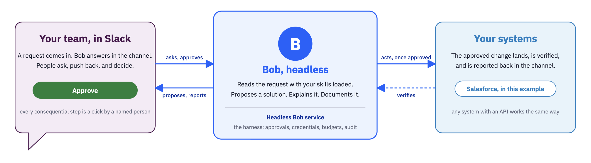

# Bring IBM Bob's Agentic Harness into Slack

A sample integration of **IBM Bob** into Slack, built on Bob Shell's
Agent Client Protocol. It shows the pattern for putting Bob where a team
already works, with the governance a shared workspace needs: Bob proposes,
explains and documents; people approve; the service acts under its own
credentials; every action is recorded.

The worked example is a Salesforce case-resolution flow. Swap the skills, the
prompts and the deployed change, and the same service serves a different
use case: code review, runbook questions, ticket triage, anything Bob can
reason about from a workspace.



## What the sample does

1. A Salesforce case arrives. The service opens a Slack channel for it and
   asks Bob to propose a solution, using Salesforce skills seeded into Bob's
   workspace and a read-only view of the org served by the service.
2. A person clicks **Approve solution**. Bob writes a use-case summary; the
   service posts it on the case in Salesforce.
3. Anyone in the channel can ask Bob about the proposal. Answers are specific
   to the case and never change anything.
4. Someone says **implement**. With `HB_FLOW_VARIANT=package`, Bob writes the
   change as Salesforce metadata, the service validates it against the org,
   Apex tests included, and asks for a second approval that lists exactly the
   components; the click deploys them. With a predefined variant the service
   deploys a fixed change instead: a new field on the Success Plan object and
   a record-triggered Flow that creates a Success Plan when a deal is won.
5. The team tests it by closing a sample deal. The service detects the new
   record and confirms it in the channel.
6. **Approve close**: closure email to the requester, change removed, case
   closed, channel archived. With the attract loop on, the next sample case
   is already waiting.


*A case channel: the alert, Bob's proposal with the approval buttons, the
summary attached to the case, and a question answered in the channel.*

A presenter's run of show with timings and talk track is in
[docs/demo-script.md](docs/demo-script.md).

Three approvals, zero code typed, one real change in the org, reversed on
close. Bob designs and writes the change; the service, not Bob, validates,
deploys and rolls it back under its own credentials. See
[docs/deployment-approaches.md](docs/deployment-approaches.md) for the three
approaches and why this one.

## How it drives Bob

The service launches `bob acp`, the Agent Client Protocol server built into
Bob Shell, one process per conversation, and talks JSON-RPC to it over
stdin/stdout. Bob owns the runtime: model access, tools, skills, shell. The
service plays the editor's role: it owns the conversation, answers Bob's
permission requests, and holds the budgets.

- Bob runs with `--trust` (the container is disposable) and never with
  `--auto-approve`. Every sensitive tool call is a permission request the
  service answers by tool kind and by the turn's approval status.
- Bob's environment is an allowlist. The Salesforce key, the Slack token and
  the mail password never reach a shell Bob runs.
- Per turn: a timeout, a permission-request budget, an output budget and a
  protocol-level cancel. Subagents off by default. A command deny-list in
  approved turns. An audit record on every job and on the
  `headless_bob.audit` logger.
- Conversations survive restarts through `session/load` when `/workspace` is
  persistent.

Verified Bob Shell behavior, with versions and dates, is in
[docs/bob-shell-behavior.md](docs/bob-shell-behavior.md). Official reference:
[Bob Shell ACP integration](https://bob.ibm.com/docs/shell/features/acp).

## Run it

Prerequisites: a Bob Shell API key; a Slack workspace where you can install
an app; a Salesforce org, a Developer Edition is fine, with an External Client
App and an integration user ([docs/salesforce-setup.md](docs/salesforce-setup.md));
Docker, or Python 3.11 and Bob Shell 2.0.4 locally.

```bash
cp env.example .env            # fill in the Bob key, Slack app, Salesforce org
python3.11 -m venv .venv && ./.venv/bin/pip install -e ".[dev]"
./.venv/bin/python -m pytest tests/            # no credentials needed

set -a; source .env; set +a
./.venv/bin/python scripts/setup_org.py        # object, notification type, sample deals (idempotent)
./.venv/bin/python -m headless_bob serve       # or: docker build -t bob-in-slack . && docker run --env-file .env -p 8080:8080 bob-in-slack
```

Then create the Slack app from [docs/slack-app-manifest.yaml](docs/slack-app-manifest.yaml)
pointing at your service URL ([docs/slack-app-setup.md](docs/slack-app-setup.md)),
open `http://localhost:8080/demo` and create a case, or set
`HB_ATTRACT_LOOP=1` to keep a sample case waiting in Slack at all times.
Deploying to a container platform: [docs/deployment.md](docs/deployment.md).

## Make it yours

[docs/customize.md](docs/customize.md) covers the four things a different use
case changes: the skills seeded into Bob's workspace, the prompts for each
beat, the change the service deploys on approval, and the approval gates
themselves. The Slack adapter is generic and exposes hooks; the case flow is
one integration built on those hooks.

## Layout

- `src/bob_runtime/` — the only code that touches Bob: the ACP runner,
  per-tenant workspaces, the permission policy and budgets
- `src/headless_bob/` — the service: HTTP API, jobs, keys, Slack adapter, the
  case flow, the Salesforce client, the Metadata API client, the package
  pipeline, the read-only org MCP server, the Success Plan artifact, the mailer
- `seeds/salesforce/.bob/` — the Salesforce skills Bob loads
- `scripts/` — `setup_org.py`, `cleanup.py`, `deploy.sh`,
  `verify_bob_version.sh`, `verify_readonly.sh`, `verify_reference.py`,
  `rollback_case.py`
- `docs/` — deployment approaches, Salesforce setup, Slack app runbook,
  customization, deployment, verified Bob behavior, the demo script
- `tests/` — 112 tests against a fake ACP agent; no credentials or Bob install

## Configuration

Every variable is listed with its default in [env.example](env.example).
Nothing is hardcoded: requester address, deal name, Slack members, mail
transport, loop behavior and all Bob switches come from the environment.

## Security model, in one paragraph

Free-form questions run read-only: the permission policy refuses edit,
execute, delete, move and fetch tool calls as Bob requests them. The two
consequential steps, deploying the change and closing the case, are button
clicks attributed to a Slack user, executed by the service with Salesforce
credentials Bob never sees; Bob's only path into the org is a read-only
endpoint on the service, bearer-token authenticated, limited to describes
and `SELECT` queries. Every inbound Slack request is signature
verified; API callers hold hashed per-tenant keys with concurrency, per-run
and daily cost caps; the Bob process sees an allowlisted environment only;
every turn leaves an audit record. Deploy one instance per team or partner,
on a platform with hostname-aware egress policy, with `/workspace` on a
persistent volume.

## License

Copyright 2026 IBM Corporation. Licensed under the Apache License, Version 2.0;
see [LICENSE](LICENSE).
