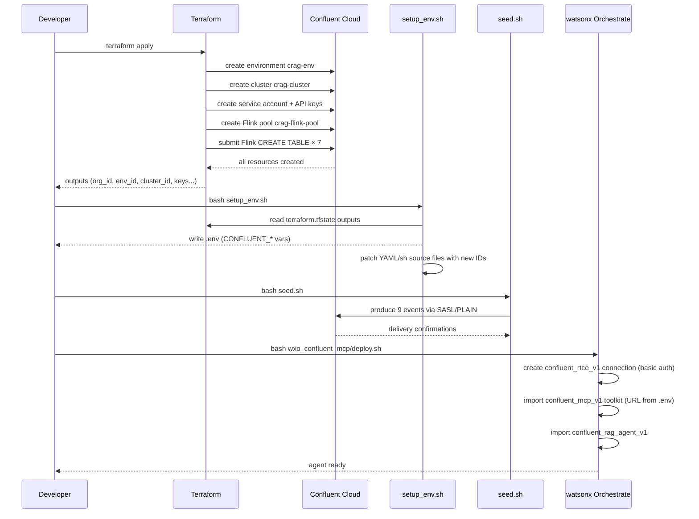
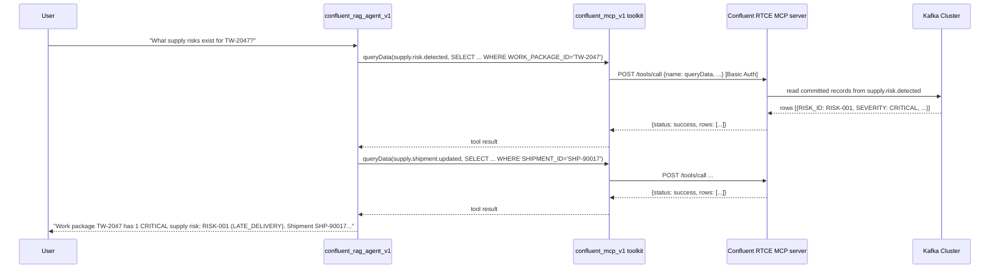
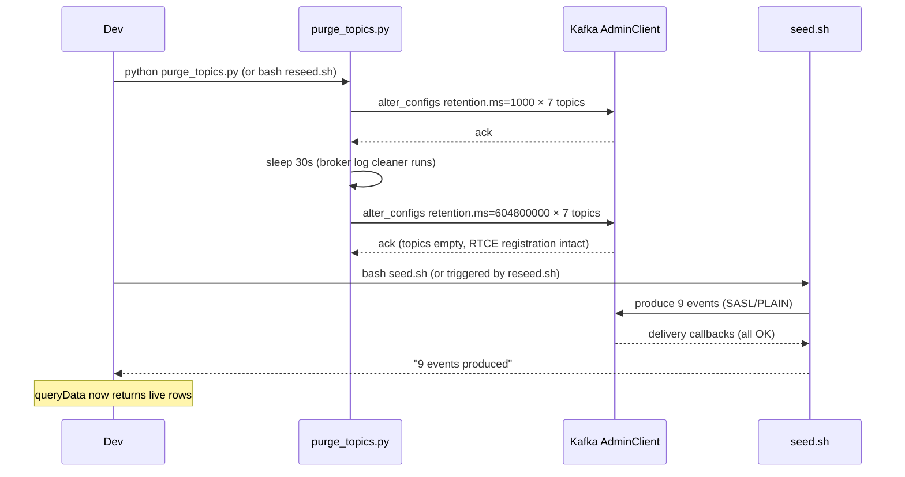

# Continuous Supply Chain RAG — Technical Design Spec

**Project:** Continuous Supply Chain RAG  
**Version:** 1.0  
**Status:** Draft  
**Date:** 2025-07  
**Author:** Bob (AI Engineering)  
> SYNTHETIC DEMO — not real Shell or Pearl GTL operational data.

---

## 1. Problem Statement

The current `wxo_confluent_mcp` setup shares a single Confluent Cloud cluster with the broader
TSCI infrastructure (Flink jobs, Kafka-only topics, service accounts, producers). This means:

- Re-deploying or resetting the WXO agent requires knowing which Terraform resources are shared and which are agent-exclusive.
- `terraform destroy` wipes **all** infrastructure — the RTCE table registrations, Flink compute
  pool, cluster API keys — forcing a full recreate cycle that takes 5–10 minutes.
- There is no clean boundary between "what the agent reads" and "what the platform produces".
- Testing a new agent scenario means either polluting production topics or a full destroy+apply.

**Goal:** Create a **dedicated, independently deployable** Confluent Cloud namespace for the
Continuous RAG agent. Topics, RTCE registration, Flink DDL, and credentials live exclusively in
this namespace and can be created, seeded, reset, and torn down without touching any other
infrastructure.

---

## 2. Goals & Non-Goals

### Goals
- Dedicated Confluent Cloud environment + cluster for the RAG agent only.
- A single `continuous_rag/` directory that owns everything: Terraform, scripts, WXO configs, agents.
- `setup.sh` that provisions from zero with a single command.
- `seed.sh` / `reseed.sh` that repopulate topics without destroying RTCE registrations.
- `destroy.sh` that tears down only the `continuous_rag` cluster — no impact on any other cluster.
- `deploy.sh` that registers the WXO connection + MCP toolkit + agent from the `continuous_rag` .env.
- No hardcoded cluster IDs anywhere in source files — all derived from Terraform state at runtime.
- Full independence: the `continuous_rag` project builds, runs, and resets with zero dependency on the parent TSCI infrastructure.

### Non-Goals
- Replacing the main TSCI Kafka infrastructure (producers, Flink stream jobs, resilience scoring).
- Creating a new WXO agent architecture — the existing `confluent_rag_agent_v1` model is reused.
- Building a new Confluent Context Engine — RTCE is a Confluent Cloud managed service.
- Modifying existing specs (`specs/03_EVENT_CONTRACTS.yaml`, etc.) — this spec adds a new design layer.

---

## 3. Architecture Overview

```mermaid
graph TB
    subgraph continuous_rag["continuous_rag/  (new root)"]
        subgraph terraform["terraform/  (dedicated cluster)"]
            TF_ENV[confluent_environment<br/>crag-env]
            TF_CL[confluent_kafka_cluster<br/>crag-cluster  Basic]
            TF_POOL[confluent_flink_compute_pool<br/>crag-flink-pool]
            TF_SA[confluent_service_account<br/>crag-app-sa]
            TF_KEYS[confluent_api_key × 3<br/>producer · flink · schema-registry]
            TF_DDL[confluent_flink_statement × 7<br/>CREATE TABLE per topic]
            TF_OUT[outputs.tf<br/>org_id · env_id · cluster_id<br/>bootstrap · sr_url · api_key]
        end

        subgraph scripts["scripts/"]
            S_SETUP[setup.sh<br/>init → apply → setup_env → seed]
            S_SEED[seed.sh<br/>produce 9 demo events]
            S_RESEED[reseed.sh<br/>purge + reseed in one command]
            S_DESTROY[destroy.sh<br/>destroy only crag cluster]
            S_ENV[setup_env.sh<br/>write .env from tfstate]
        end

        subgraph wxo_dir["wxo_confluent_mcp/  (moved here)"]
            WD[deploy.sh]
            WR[remove.sh]
            WS[seed.sh → proxies to scripts/seed.sh]
            WP[purge_topics.py]
            WD2[diagnose.py]
            WA[agents/native/confluent_rag_agent.yaml]
            WC[connections/confluent_rtce.yaml]
            WT[toolkits/confluent_mcp.yaml]
        end

        ENV[.env  auto-generated by setup_env.sh]
        ENVE[.env.example  template]
    end

    subgraph confluent["Confluent Cloud  (crag-env)"]
        KC[Kafka Cluster<br/>crag-cluster]
        FLINK[Flink Pool<br/>crag-flink-pool]
        SR[Schema Registry<br/>auto-provisioned]
        RTCE[Real-Time Context Engine<br/>MCP server]
        T1[supply.risk.detected]
        T2[supply.shipment.updated]
        T3[turnaround.material.required]
        T4[supply.supplier.status.changed]
        T5[supply.material.readiness.assessed]
        T6[supply.port.status.changed]
        T7[supply.approved_vendor.changed]
    end

    subgraph wxo["watsonx Orchestrate"]
        CONN[confluent_rtce_v1 connection<br/>basic auth]
        TK[confluent_mcp_v1 toolkit<br/>streamable_http MCP]
        AGENT[confluent_rag_agent_v1<br/>react_core · gpt-oss-120b]
    end

    TF_DDL -->|Flink CREATE TABLE| T1 & T2 & T3 & T4 & T5 & T6 & T7
    WP -->|retention-based purge| T1 & T2 & T3 & T4 & T5 & T6 & T7
    S_SEED -->|produce 9 events| T1 & T2 & T3 & T4 & T5 & T6 & T7
    RTCE -->|reads| T1 & T2 & T3 & T4 & T5 & T6 & T7
    WD -->|deploys| CONN & TK & AGENT
    TK -->|MCP HTTP| RTCE
    CONN -->|Basic Auth credentials| TK
    AGENT -->|uses| TK
```



---

## 4. Directory Structure

### 4.1 Post-Refactor Layout

```
continuous_rag/
├── .env                        ← auto-generated by scripts/setup_env.sh (gitignored)
├── .env.example                ← template for first-time setup
├── .gitignore                  ← ignores .env, terraform.tfstate, *.tfvars
│
├── terraform/                  ← dedicated Confluent Cloud cluster for RAG agent only
│   ├── main.tf                 ← environment, cluster, pool, SA, API keys, Flink DDL
│   ├── outputs.tf              ← all IDs + credentials as outputs
│   ├── providers.tf            ← confluent provider ≥2.68.0
│   ├── variables.tf            ← confluent_cloud_api_key, confluent_cloud_api_secret
│   └── terraform.tfvars        ← gitignored; contains Cloud API key + secret
│
├── scripts/
│   ├── setup.sh                ← full init: terraform apply → setup_env → seed
│   ├── setup_env.sh            ← write .env from tfstate; patch source file IDs
│   ├── seed.sh                 ← produce 9 synthetic demo events across 7 topics
│   ├── reseed.sh               ← purge + reseed in one idempotent command
│   ├── destroy.sh              ← terraform destroy for crag cluster only
│   └── status.sh               ← show live cluster + Flink statement status
│
└── wxo_confluent_mcp/          ← WXO agent configs (moved from repo root)
    ├── .env.example            ← WXO-specific credential template
    ├── deploy.sh               ← register connection + toolkit + agent in WXO
    ├── remove.sh               ← clean teardown of WXO resources
    ├── purge_topics.py         ← retention-based topic purge (no RTCE impact)
    ├── diagnose.py             ← raw MCP API smoke test
    ├── validate_schema.py      ← cross-check seeder ↔ RTCE ↔ Terraform
    ├── test_mcp_local.py       ← local MCP transport test
    │
    ├── agents/
    │   └── native/
    │       └── confluent_rag_agent.yaml
    ├── connections/
    │   └── confluent_rtce.yaml
    └── toolkits/
        └── confluent_mcp.yaml
```

### 4.2 Migration from `wxo_confluent_mcp/` (repo root)

All existing files move verbatim into `continuous_rag/wxo_confluent_mcp/`.  
All relative path references (`../`, `../../`) in `.sh` and `.py` files are updated to reflect
the new two-level depth from repo root.  
A `setup_env.sh` in `continuous_rag/scripts/` replaces the one currently at
`wxo_confluent_mcp/setup_env.sh`.

---

## 5. Terraform Design — Dedicated Cluster

### 5.1 Resource List

| Resource | Name | Key Config | Purpose |
|---|---|---|---|
| `confluent_environment` | `crag-env` | display_name = `crag` | Isolated environment for RAG agent |
| `confluent_kafka_cluster` | `crag-cluster` | Basic, SINGLE_ZONE, us-east-1, AWS | Kafka cluster (cheapest tier) |
| `confluent_schema_registry_cluster` | data source | auto-provisioned | Auto-registered SR; discovered after 60s wait |
| `confluent_flink_region` | data source | us-east-1 / AWS | Region resolution for Flink |
| `confluent_flink_compute_pool` | `crag-flink-pool` | max_cfu=5 | Flink statement execution (small — DDL only) |
| `confluent_service_account` | `crag-app-sa` | display_name = `crag-app` | One SA for all API keys |
| `confluent_role_binding` | `crag_kafka_admin` | CloudClusterAdmin | Producer + topic management |
| `confluent_role_binding` | `crag_flink_developer` | FlinkDeveloper | Flink SQL execution |
| `confluent_role_binding` | `crag_env_admin` | EnvironmentAdmin | SR access |
| `confluent_api_key` | `crag_kafka_producer` | owner = crag-app-sa | Kafka SASL credentials for seeder |
| `confluent_api_key` | `crag_flink` | owner = crag-app-sa | Flink SQL statements |
| `confluent_api_key` | `crag_schema_registry` | owner = crag-app-sa | SR access |
| `time_sleep` | `wait_for_rbac` | 30s after all role bindings | RBAC propagation guard |
| `confluent_flink_statement` × 7 | one per topic | `CREATE TABLE` DDL | Register RTCE table schemas |

### 5.2 Flink Statement Design

Each of the 7 topics gets exactly **one** `confluent_flink_statement` resource that runs:

```sql
CREATE TABLE IF NOT EXISTS `<topic-name>` (
  <columns>,
  WATERMARK FOR occurred_at AS occurred_at - INTERVAL '5' SECONDS,
  PRIMARY KEY (<pk-columns>) NOT ENFORCED
) WITH (
  'key.format'   = 'json-registry',
  'value.format' = 'json-registry',
  'kafka.consumer.isolation-level' = 'read-uncommitted'
)
```

**Important:** No Flink INSERT jobs — the `continuous_rag` cluster is a **read model** only.
Events are seeded by `scripts/seed.sh` (Python producer). No stream-processing jobs are needed
because the RTCE reads directly from the Kafka topic log.

This simplification (vs the parent TSCI cluster which has risk_detection and readiness_assessment
INSERT jobs) means:
- Flink pool can be `max_cfu=5` (vs 10 in the parent).
- Terraform apply is faster (no INSERT job wait).
- Topics are writable only by the seeder; no derived/computed topics.

### 5.3 `outputs.tf` — Required Outputs

```hcl
output "org_id"                       { value = data.confluent_organization.main.id }
output "environment_id"               { value = confluent_environment.main.id }
output "cluster_id"                   { value = confluent_kafka_cluster.main.id }
output "kafka_bootstrap_servers"      { value = replace(confluent_kafka_cluster.main.bootstrap_endpoint, "SASL_SSL://", "") }
output "bootstrap_host"               { value = split(":", replace(...))[0] }
output "schema_registry_url"          { value = ... }
output "kafka_producer_api_key"       { value = ...; sensitive = true }
output "kafka_producer_api_secret"    { value = ...; sensitive = true }
output "schema_registry_api_key"      { value = ...; sensitive = true }
output "schema_registry_api_secret"   { value = ...; sensitive = true }
```

---

## 6. Topic Schemas

All 7 topics retain their existing schemas (verified live from the current cluster via
`getMetadata`). No schema changes in this project.

| Topic | Primary Key | Array Fields | Seeded Data |
|---|---|---|---|
| `turnaround.material.required` | `REQUIREMENT_ID` | — | REQ-xxx, CVA-8842, TW-2047 |
| `supply.shipment.updated` | `SHIPMENT_ID` | — | SHP-90017, delayed 7d |
| `supply.supplier.status.changed` | `SUPPLIER_ID + MATERIAL_ID` | `IMPACTED_PO_IDS` | SUP-101 QUALITY_HOLD, SUP-203 PORT_CONGESTION |
| `supply.port.status.changed` | `PORT_CODE` | `IMPACTED_SHIPMENT_IDS`, `AFFECTED_LOGISTICS_PROVIDERS` | SGSIN CONGESTION HIGH |
| `supply.approved_vendor.changed` | `MATERIAL_ID + SUPPLIER_ID` | — | SUP-205 APPROVED TERTIARY |
| `supply.risk.detected` | `RISK_ID` | — | RISK-001 CRITICAL LATE_DELIVERY |
| `supply.material.readiness.assessed` | `ASSESSMENT_ID` | — | AT_RISK resilience_score=78 |

---

## 7. Credential Design

Two separate credential pairs are needed. They **must never be mixed**.

| Credential Pair | Variable Names | Source | Used by |
|---|---|---|---|
| **Kafka Producer** (SASL/PLAIN) | `CONFLUENT_BOOTSTRAP_SERVERS` `CONFLUENT_API_KEY` `CONFLUENT_API_SECRET` | Terraform output (`crag_kafka_producer` key) | `scripts/seed.sh`, `purge_topics.py` |
| **RTCE / MCP** (HTTP Basic Auth) | `CONFLUENT_RTCE_API_KEY` `CONFLUENT_RTCE_API_SECRET` | Confluent Cloud UI → API Keys → Context Engine SA (**manual, once**) | `wxo_confluent_mcp/deploy.sh`, `diagnose.py`, WXO agent at runtime |

**RTCE credentials are NOT in Terraform state.** They are a Context Engine service account
provisioned once from the Confluent Cloud UI and preserved across cluster recreates by
`scripts/setup_env.sh`.

### 7.1 `.env` File

`continuous_rag/.env` is auto-generated by `scripts/setup_env.sh`. Template:

```env
# Auto-generated by continuous_rag/scripts/setup_env.sh — DO NOT edit manually.
# NEVER commit this file to git.

# ── RTCE / MCP credentials (manual — from Confluent Cloud UI) ────────────────
CONFLUENT_RTCE_API_KEY=<preserved or REPLACE_WITH_RTCE_API_KEY>
CONFLUENT_RTCE_API_SECRET=<preserved>

# ── MCP Server URL (rebuilt from Terraform outputs) ──────────────────────────
CONFLUENT_MCP_URL=https://mcp.us-east-1.aws.confluent.cloud/mcp/v1/context-engine/organizations/<org>/environments/<env>/kafka-clusters/<cluster>

# ── Kafka Producer credentials (from Terraform state) ────────────────────────
CONFLUENT_BOOTSTRAP_SERVERS=pkc-xxx.us-east-1.aws.confluent.cloud:9092
CONFLUENT_API_KEY=<crag_kafka_producer key>
CONFLUENT_API_SECRET=<crag_kafka_producer secret>
CONFLUENT_CLUSTER_ID=<lkc-xxx>
CONFLUENT_REST_URL=https://pkc-xxx.us-east-1.aws.confluent.cloud:443

# ── Schema Registry ───────────────────────────────────────────────────────────
CONFLUENT_SCHEMA_REGISTRY_URL=https://psrc-xxx.us-east-1.aws.confluent.cloud
CONFLUENT_SCHEMA_REGISTRY_API_KEY=<sr key>
CONFLUENT_SCHEMA_REGISTRY_API_SECRET=<sr secret>

# ── WXO connection app-id (fixed) ────────────────────────────────────────────
CONFLUENT_CONNECTION_APP_ID=confluent_rtce_v1
```

---

## 8. Scripts Design

### 8.1 `scripts/setup.sh` — Full Provisioning

```
setup.sh
  [1/5] Prerequisites: terraform, python3, pip3, confluent CLI
  [2/5] terraform init + apply (auto-approve)
  [3/5] scripts/setup_env.sh  → write .env from tfstate
  [4/5] pip install confluent-kafka==2.4.0
  [5/5] scripts/seed.sh       → produce 9 demo events
```

**Idempotent:** Re-running after a partial failure is safe. Terraform apply is idempotent;
`setup_env.sh` preserves RTCE credentials; `seed.sh` overwrites existing events (upsert by PK).

### 8.2 `scripts/setup_env.sh` — Credential Sync

Reads all IDs and credentials from `terraform/terraform.tfstate` outputs:

1. Extract: `org_id`, `env_id`, `cluster_id`, `bootstrap`, `bootstrap_host`, `api_key`, `api_secret`, `sr_url`, `sr_key`, `sr_secret`
2. Preserve: `CONFLUENT_RTCE_API_KEY/SECRET` from existing `.env` (or emit warning if unset)
3. Compute: `CONFLUENT_MCP_URL`, `CONFLUENT_REST_URL`
4. Write: `continuous_rag/.env`
5. Patch source files: `wxo_confluent_mcp/toolkits/confluent_mcp.yaml`, `connections/confluent_rtce.yaml`, `agents/native/confluent_rag_agent.yaml`, `deploy.sh`, `diagnose.py`

Fully idempotent — if IDs haven't changed, source files are not modified.

### 8.3 `scripts/seed.sh` — Topic Population

Calls `wxo_confluent_mcp/seed_topics.py` with producer credentials from `.env`.  
Produces 9 events across 7 topics in causal order for scenario `DEMO-TW2047-001`.

| # | Topic | Key | Event |
|---|---|---|---|
| 1 | `turnaround.material.required` | `TW-2047:CVA-8842` | Requirement raised |
| 2 | `supply.supplier.status.changed` | `SUP-101:CVA-8842` | QUALITY_HOLD CRITICAL |
| 3 | `supply.supplier.status.changed` | `SUP-203:CVA-8842` | PORT_CONGESTION HIGH |
| 4 | `supply.port.status.changed` | `SGSIN` | CONGESTION HIGH |
| 5 | `supply.approved_vendor.changed` | `SUP-205:CVA-8842` | APPROVED TERTIARY |
| 6 | `supply.shipment.updated` | `SHP-90017` | DELAYED 7 days |
| 7 | `supply.risk.detected` | `RISK-001` | CRITICAL LATE_DELIVERY |
| 8 | `supply.material.readiness.assessed` | `TW-2047:CVA-8842` | AT_RISK score=78 |

Flags: `--dry-run`, `--correlation-id <id>`

### 8.4 `scripts/reseed.sh` — Idempotent Re-population

```bash
reseed.sh
  Step 1 — python wxo_confluent_mcp/purge_topics.py  (retention-based truncation, 30s wait)
  Step 2 — scripts/seed.sh                           (produce fresh events)
```

Use this to reset demo state between runs without touching RTCE or Terraform.

### 8.5 `scripts/destroy.sh` — Targeted Teardown

```bash
destroy.sh
  [warn] This will destroy the crag-env Confluent Cloud environment
  [confirm] Requires --force flag or interactive confirmation
  terraform destroy -auto-approve
  rm -f terraform/terraform.tfstate* terraform/terraform.tfvars .env
```

**Only destroys the `continuous_rag` cluster.** Has no effect on any other Confluent Cloud
environment, WXO workspace, or application infrastructure.

### 8.6 `wxo_confluent_mcp/deploy.sh` — WXO Registration

Unchanged from current `wxo_confluent_mcp/deploy.sh` except path references updated.  
Reads credentials from `continuous_rag/.env`.  
Steps: teardown (agent→toolkit→connection) → connection → toolkit → agent.

---

## 9. WXO Agent Design

The `confluent_rag_agent_v1` agent definition is **unchanged**. It is moved verbatim into
`continuous_rag/wxo_confluent_mcp/agents/native/confluent_rag_agent.yaml`.

Key properties retained:

| Property | Value |
|---|---|
| Name | `confluent_rag_agent_v1` |
| Model | `groq/openai/gpt-oss-120b` |
| Style | `react_core` |
| Temperature | `0.0` |
| Parallel tool calls | `true` |
| Toolkit | `confluent_mcp_v1` |
| Tools | `listTopics`, `getMetadata`, `queryData` |
| Error handling | `TABLE_NOT_MATERIALIZED` → instructs user to run `scripts/seed.sh` |

---

## 10. Sequence Diagrams

### 10.1 Full Setup Flow



### 10.2 Agent Query Flow



### 10.3 Reseed Flow (Demo Reset)



---

## 11. Error Handling & Edge Cases

| Error | Scenario | Handling |
|---|---|---|
| `TABLE_NOT_MATERIALIZED` | Topics empty (post-apply, pre-seed) | Agent instructs user to run `scripts/seed.sh` |
| `DP_INVALID_TABLE` | RTCE registration broken (topic was deleted) | Run `wxo_confluent_mcp/restore_rtce.sh` (DROP+CREATE), then `seed.sh` |
| `CONFLUENT_RTCE_API_KEY` unset | RTCE credentials not set after apply | `setup_env.sh` emits warning with Confluent Cloud UI instructions |
| `terraform apply` fails mid-way | Partial state | Re-run `setup.sh` — Terraform is idempotent |
| `seed.sh` delivery error | Broker unreachable | Check `CONFLUENT_BOOTSTRAP_SERVERS` in `.env`; re-run `setup_env.sh` |
| Cluster IDs stale in source files | After destroy+apply | `setup_env.sh` detects via toolkit YAML diff and sed-patches all files |
| Topics missing after apply | Flink DDL statement failed | Run `scripts/status.sh`; check Flink statement status in Confluent UI |

---

## 12. Testing Strategy

### 12.1 Smoke Test (post-deploy)

```bash
python continuous_rag/wxo_confluent_mcp/diagnose.py
```

Expected: all 7 topics return `status: success` with at least 1 row from `queryData`.

### 12.2 Schema Validation

```bash
python continuous_rag/wxo_confluent_mcp/validate_schema.py
```

Checks: seeder field names ↔ RTCE getMetadata columns ↔ Terraform Flink DDL (case-insensitive).

### 12.3 Full Reset Test

```bash
bash continuous_rag/scripts/reseed.sh
python continuous_rag/wxo_confluent_mcp/diagnose.py
```

Verifies: purge → reseed cycle leaves all 7 topics live with fresh rows.

### 12.4 Isolation Test

Verify `continuous_rag` cluster is truly independent:
```bash
# destroy crag cluster
bash continuous_rag/scripts/destroy.sh --force
# confirm main TSCI infrastructure unaffected (different env_id)
terraform -chdir=confluent/terraform show | grep environment_id
```

---

## 13. Migration Steps (Repo Restructure)

This section describes the exact file operations to execute the refactor.

```
Step 1 — Create new root directory
  mkdir -p continuous_rag/terraform
  mkdir -p continuous_rag/scripts
  mkdir -p continuous_rag/wxo_confluent_mcp/agents/native
  mkdir -p continuous_rag/wxo_confluent_mcp/connections
  mkdir -p continuous_rag/wxo_confluent_mcp/toolkits

Step 2 — Copy agent configs (verbatim, no content changes)
  cp wxo_confluent_mcp/agents/native/confluent_rag_agent.yaml
     → continuous_rag/wxo_confluent_mcp/agents/native/
  cp wxo_confluent_mcp/connections/confluent_rtce.yaml
     → continuous_rag/wxo_confluent_mcp/connections/
  cp wxo_confluent_mcp/toolkits/confluent_mcp.yaml
     → continuous_rag/wxo_confluent_mcp/toolkits/

Step 3 — Copy Python/shell scripts (update relative paths)
  cp wxo_confluent_mcp/deploy.sh      → continuous_rag/wxo_confluent_mcp/
  cp wxo_confluent_mcp/remove.sh      → continuous_rag/wxo_confluent_mcp/
  cp wxo_confluent_mcp/purge_topics.py → continuous_rag/wxo_confluent_mcp/
  cp wxo_confluent_mcp/diagnose.py    → continuous_rag/wxo_confluent_mcp/
  cp wxo_confluent_mcp/validate_schema.py → continuous_rag/wxo_confluent_mcp/
  cp wxo_confluent_mcp/test_mcp_local.py → continuous_rag/wxo_confluent_mcp/
  cp wxo_confluent_mcp/.env.example   → continuous_rag/wxo_confluent_mcp/

  Path changes in scripts (../→ ../../, etc.):
    REPO_ROOT="$(cd "${SCRIPT_DIR}/../.." && pwd)"   # two levels up from wxo_confluent_mcp
    ENV_FILE="${REPO_ROOT}/continuous_rag/.env"

Step 4 — Create NEW files in continuous_rag/
  continuous_rag/terraform/main.tf        (new — dedicated crag cluster)
  continuous_rag/terraform/outputs.tf     (new)
  continuous_rag/terraform/providers.tf   (copy from confluent/terraform/providers.tf)
  continuous_rag/terraform/variables.tf   (new — simpler than parent)
  continuous_rag/scripts/setup.sh         (new)
  continuous_rag/scripts/setup_env.sh     (adapted from wxo_confluent_mcp/setup_env.sh)
  continuous_rag/scripts/seed.sh          (adapted from wxo_confluent_mcp/seed.sh)
  continuous_rag/scripts/reseed.sh        (new — purge + seed)
  continuous_rag/scripts/destroy.sh       (new — scoped destroy)
  continuous_rag/scripts/status.sh        (new)
  continuous_rag/.env.example             (new — unified template)
  continuous_rag/.gitignore               (new)
  continuous_rag/wxo_confluent_mcp/seed_topics.py  (adapted from wxo/confluent/seed_confluent_topics.py)

Step 5 — Validate (no changes to main cluster)
  python continuous_rag/wxo_confluent_mcp/diagnose.py
```

---

## 14. Open Questions & Risks

| # | Question | Owner | Status |
|---|---|---|---|
| Q1 | Should `continuous_rag/terraform/` use a **separate Confluent Cloud API key** (different from `confluent/terraform/terraform.tfvars`)? Recommended: yes — one SA per cluster project. | Infra | Open |
| Q2 | Should the `continuous_rag` cluster be in a **different region** (e.g. eu-west-1) for disaster-recovery demo testing? | Product | Open |
| Q3 | RTCE credentials (`CONFLUENT_RTCE_API_KEY/SECRET`) — are they **per-environment** or **org-level**? If per-env, new credentials are needed after `destroy.sh`. | Confluent | Needs confirmation |
| Q4 | Should `wxo_confluent_mcp/` remain **also at the repo root** (unchanged) as the production path, with `continuous_rag/wxo_confluent_mcp/` as the dev/demo path? Or is the root version deprecated? | Product | Decision needed before migration |
| R1 | **Risk:** RTCE is an org-level feature — all clusters share one RTCE namespace. The 7 topic names (`supply.risk.detected` etc.) must be **unique** across all clusters in the org. If `continuous_rag` cluster uses identical topic names as the parent cluster, RTCE may return data from either cluster depending on registration order. **Mitigation:** Use a topic prefix for the crag cluster (e.g. `crag.supply.risk.detected`) OR ensure parent cluster topics are always registered first. | Infra | Needs investigation |
| R2 | **Risk:** Confluent Basic cluster doesn't support multi-region replication. Fine for a demo. | N/A | Accepted |

---

## 15. Acceptance Criteria

- [ ] `bash continuous_rag/scripts/setup.sh` provisions the full cluster and seeds all 7 topics from zero with a single command.
- [ ] `python continuous_rag/wxo_confluent_mcp/diagnose.py` returns `status: success` with rows for all 7 topics after setup.
- [ ] `bash continuous_rag/scripts/reseed.sh` resets all topics and repopulates them without RTCE registration loss.
- [ ] `bash continuous_rag/scripts/destroy.sh --force` tears down only the `crag-env` cluster — all other Confluent Cloud environments are unaffected.
- [ ] `bash continuous_rag/wxo_confluent_mcp/deploy.sh` registers the agent in WXO; the agent answers supply chain queries from the `continuous_rag` cluster data.
- [ ] No hardcoded cluster IDs, org IDs, or credentials in any source file — all derived from `terraform.tfstate` at runtime.
- [ ] Re-running `setup.sh` on an already-provisioned cluster is idempotent (no errors, no duplicate resources).
- [ ] `CONFLUENT_RTCE_API_KEY/SECRET` is preserved across `destroy.sh` + `setup.sh` cycles by `setup_env.sh`.
