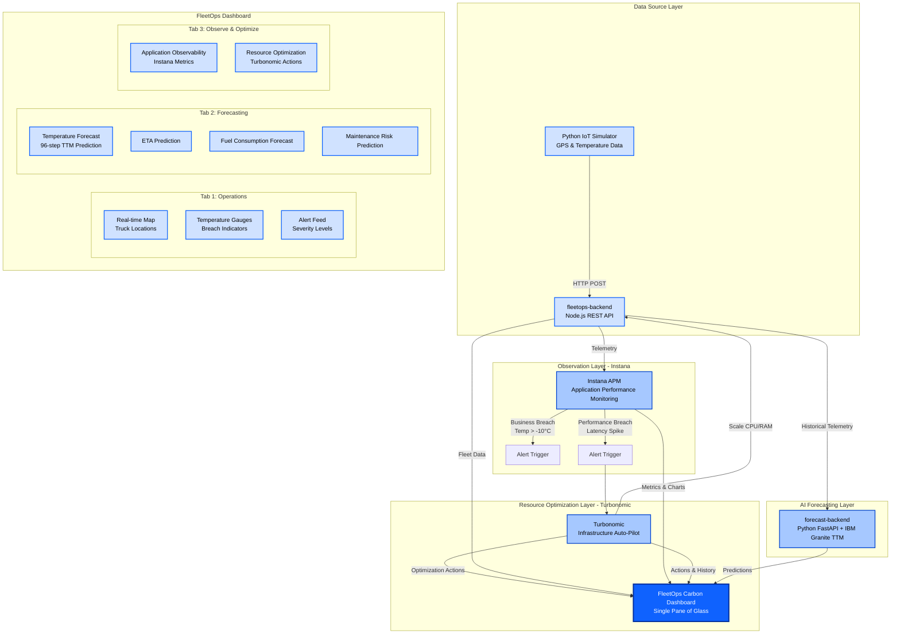
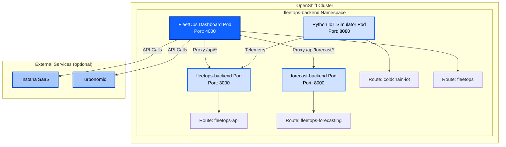

# FleetOps — Architecture

## Solution Architecture



## Implementation Status

### ✅ Implemented Components
- **Python IoT Simulator** — Streaming GPS & temperature data
- **fleetops-backend (Node.js)** — REST API gateway with telemetry, alerts, stations, and agent endpoints
- **forecast-backend (Python FastAPI)** — IBM Granite TTM model serving temperature, ETA, fuel, and maintenance forecasts
- **Instana Integration** — Real-time APM metrics in the Observe tab
- **Turbonomic Integration** — Resource optimization actions in the Observe tab
- **FleetOps Dashboard** — IBM Carbon Design System UI with 3 tabs

### 🚀 Planned Components
- **watsonx Orchestrate Agents** — Weather, route, station, and decision agents (see ARCHITECTURE_WITH_AGENTS.md)
- **webMethods Integration** — Automated remediation workflows
- **Apptio/FinOps** — Cost tracking and ROI reporting

---

## Data Flow

### Normal Operation
```
IoT Simulator → fleetops-backend → Instana (Monitoring) → FleetOps Dashboard (Display)
                                 → forecast-backend (TTM) → FleetOps Dashboard (Forecasting)
```

### Breach Detection
```
IoT Simulator (Temp Spike)
  → fleetops-backend (Receives Alert)
  → Instana (Detects Breach)
  → Turbonomic (Scales Resources)
  → FleetOps Dashboard (Shows Alert + Action)
```

---

## Technology Stack

### Frontend
- **IBM Carbon Design System** — UI components and design language
- **Leaflet.js** — Interactive maps
- **Chart.js** — Performance and forecast charts
- **Vanilla JavaScript** — No framework overhead

### Backend (FleetOps)
- **Node.js + Express** — REST API proxy server
- **Axios** — HTTP client for backend calls

### Backend Services
- **fleetops-backend** — Node.js, real-time telemetry and alert management
- **forecast-backend** — Python FastAPI, IBM Granite TTM model

### Integrations
- **Instana APM** — Application observability
- **Turbonomic** — Resource optimization
- **OpenShift** — Container orchestration

---

## Deployment Architecture



---

## Future Enhancements

### Phase 2: watsonx Orchestrate Agents
See [ARCHITECTURE_WITH_AGENTS.md](./ARCHITECTURE_WITH_AGENTS.md) for the full agent architecture design.

### Phase 3: webMethods Integration
- Automated emergency cooling commands
- WhatsApp driver alerts
- ERP integration for bay reservation
- AI-powered route optimization

### Phase 4: Financial Visibility
- Apptio/FinOps integration
- Real-time cost tracking
- ROI calculations and reporting

---

**Built with IBM Carbon Design System and IBM Granite TTM**
