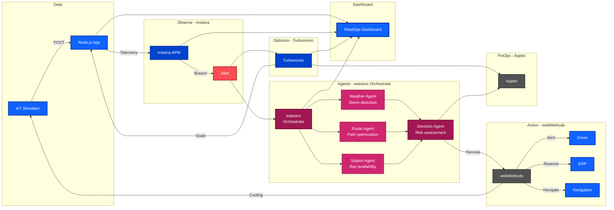
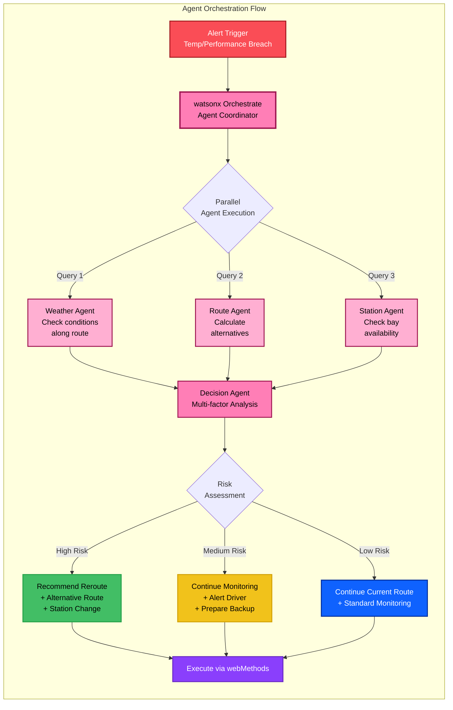
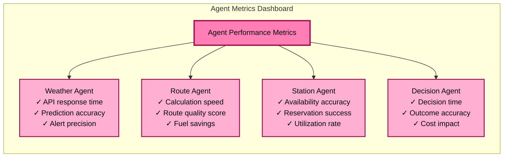

# Smart Cold-Chain Guardrail - Architecture with watsonx Orchestrate Agents

## Solution Architecture with Intelligent Agent Layer



## Agent Architecture Details

### watsonx Orchestrate Agent Framework



## Agent Capabilities

### 1. Weather Intelligence Agent
**Purpose:** Monitor and analyze weather conditions affecting cold-chain routes

**Data Sources:**
- Real-time weather APIs (OpenWeatherMap, Weather.com)
- NOAA storm tracking systems
- Local weather station feeds
- Historical weather patterns

**Capabilities:**
- Storm detection and tracking
- Temperature forecast along route
- Road condition assessment
- Visibility and safety analysis
- Severe weather alerts

**Decision Factors:**
- Storm severity (Category 1-5)
- Temperature extremes
- Road ice/snow conditions
- Wind speed impact on refrigeration
- Visibility < 100m threshold

### 2. Route Optimization Agent
**Purpose:** Calculate optimal alternative routes based on multiple factors

**Data Sources:**
- Google Maps / HERE Maps APIs
- Real-time traffic data
- Road closure databases
- Historical route performance
- Fuel consumption patterns

**Capabilities:**
- Multi-route calculation (3-5 alternatives)
- ETA prediction with confidence intervals
- Fuel efficiency optimization
- Traffic pattern analysis
- Road quality assessment

**Decision Factors:**
- Distance vs. time trade-offs
- Fuel cost optimization
- Temperature stability during transit
- Driver rest stop requirements
- Toll road vs. free route analysis

### 3. Destination Station Agent
**Purpose:** Manage destination station capacity and readiness

**Data Sources:**
- Station management systems
- Bay availability calendars
- Dock scheduling systems
- Maintenance schedules
- Historical capacity data

**Capabilities:**
- Real-time bay availability check
- Dock scheduling and reservation
- Capacity forecasting
- Equipment readiness verification
- Alternative station suggestions

**Decision Factors:**
- Bay availability (current + 2hr window)
- Unloading equipment status
- Cold storage capacity
- Station operating hours
- Distance from alternative stations

### 4. Decision Orchestrator Agent
**Purpose:** Synthesize inputs from all agents and make final recommendations

**Analysis Framework:**
- **Risk Scoring:** 0-100 scale based on weighted factors
- **Cost-Benefit Analysis:** Reroute cost vs. product loss risk
- **Time Impact:** Delivery delay vs. safety margin
- **Compliance Check:** Regulatory requirements validation

**Decision Matrix:**

| Risk Score | Weather | Route | Station | Action |
|------------|---------|-------|---------|--------|
| 0-30 (Low) | Clear | Optimal | Available | Continue |
| 31-60 (Medium) | Moderate | Congested | Limited | Monitor + Alert |
| 61-80 (High) | Severe | Blocked | Full | Reroute |
| 81-100 (Critical) | Extreme | Closed | Unavailable | Emergency Stop |

## Enhanced Data Flow with Agents

### Scenario 1: Weather-Based Rerouting
```
IoT Simulator (Temp Spike + GPS Location)
  → Node.js App (Receives Alert)
  → Instana (Detects Breach)
  → watsonx Orchestrate (Triggers Agent Workflow)
    → Weather Agent (Checks storm path: Severe thunderstorm ahead)
    → Route Agent (Calculates 3 alternatives: Route B saves 45min)
    → Station Agent (Checks Station B: 2 bays available)
    → Decision Agent (Risk Score: 75 - Recommend Reroute)
  → webMethods (Executes Reroute)
    → Navigation System (Updates driver GPS)
    → Station B (Reserves bay #3)
    → Driver Mobile (WhatsApp: "Rerouting to Station B due to storm")
  → Dashboard (Shows new route + agent reasoning)
```

### Scenario 2: Station Capacity Rerouting
```
IoT Simulator (Normal operation, approaching destination)
  → Node.js App (Routine check)
  → watsonx Orchestrate (Proactive station check)
    → Station Agent (Checks Station A: All bays full, 3hr wait)
    → Route Agent (Calculates route to Station C: +20min)
    → Weather Agent (Checks conditions: Clear, no issues)
    → Decision Agent (Risk Score: 45 - Recommend Station Change)
  → webMethods (Executes Station Change)
    → Station C (Reserves bay #1)
    → Driver Mobile (WhatsApp: "Proceed to Station C, bay ready")
    → ERP System (Updates delivery schedule)
  → Dashboard (Shows updated destination + reasoning)
```

### Scenario 3: Multi-Factor Emergency Rerouting
```
IoT Simulator (Temp Spike + GPS in storm zone)
  → Node.js App (Emergency alert)
  → Instana (Critical breach detected)
  → watsonx Orchestrate (Emergency agent workflow)
    → Weather Agent (Severe storm, road closures)
    → Route Agent (Only 1 viable alternative, +60min)
    → Station Agent (Station D available, has emergency bay)
    → Decision Agent (Risk Score: 85 - Emergency Reroute)
  → webMethods (Emergency protocol)
    → Emergency Cooling (Activated)
    → Navigation System (Emergency route)
    → Station D (Emergency bay reserved)
    → Driver Mobile (WhatsApp: "EMERGENCY: Follow new route immediately")
    → Supervisor (SMS alert sent)
  → Dashboard (Red alert + full agent decision trail)
```

## Implementation Status

### ✅ Implemented Components
- **Python IoT Simulator** - Streaming GPS & temperature data
- **Node.js Customer App** - REST API gateway with telemetry endpoints
- **Instana Integration** - Real-time APM with breach detection
- **Turbonomic Integration** - Resource optimization with action execution
- **FleetOps Dashboard** - IBM Carbon Design System UI with 2 tabs

### 🚀 New Agent Components (Planned)
- **watsonx Orchestrate Integration** - Agent orchestration platform
- **Weather Intelligence Agent** - Real-time weather monitoring and analysis
- **Route Optimization Agent** - Dynamic route calculation and optimization
- **Destination Station Agent** - Station capacity and availability management
- **Decision Orchestrator Agent** - Multi-factor decision making and risk assessment

### ⚠️ Planned Components
- **webMethods Integration** - Automated remediation workflows
- **Apptio/FinOps** - Cost tracking and ROI reporting (including reroute costs)

---

## Technology Stack Enhancement

### AI & Agent Layer (NEW)
- **watsonx Orchestrate** - Agent orchestration and workflow automation
- **watsonx.ai** - Foundation models for decision intelligence
- **IBM watsonx Assistant** - Conversational AI for driver interaction
- **LangChain** - Agent framework and tool integration

### External APIs (NEW)
- **OpenWeatherMap API** - Real-time weather data
- **Google Maps Platform** - Route calculation and traffic data
- **HERE Maps API** - Alternative routing and road conditions
- **Station Management APIs** - Bay availability and scheduling

### Frontend (Enhanced)
- **IBM Carbon Design System** - UI components
- **Leaflet.js** - Interactive maps with route overlays
- **Chart.js** - Performance charts + agent decision visualization
- **Vanilla JavaScript** - No framework overhead

### Backend (Enhanced)
- **Node.js + Express** - REST API server + Agent proxy
- **Python** - IoT simulator + Agent integration
- **Axios** - HTTP client for integrations
- **WebSocket** - Real-time agent updates

### Integrations
- **Instana APM** - Application observability
- **Turbonomic** - Resource optimization
- **OpenShift** - Container orchestration
- **watsonx Orchestrate** - Agent orchestration

### Development Tools
- **IBM Bob (watsonx Code Assistant)** - AI-powered development
- **Docker** - Containerization
- **Git** - Version control

---

## Agent Decision Metrics

### Key Performance Indicators (KPIs)

| Metric | Target | Current | Impact |
|--------|--------|---------|--------|
| Reroute Decision Time | < 30 seconds | TBD | Faster response to threats |
| Weather Prediction Accuracy | > 90% | TBD | Reduced false positives |
| Route Optimization Savings | 15% fuel reduction | TBD | Cost savings |
| Station Utilization | > 85% | TBD | Improved efficiency |
| Product Loss Prevention | < 2% spoilage | TBD | Revenue protection |

### Agent Performance Tracking



---

## Future Enhancements

### Phase 6: watsonx Orchestrate Agent Implementation
- Deploy Weather Intelligence Agent with real-time APIs
- Implement Route Optimization Agent with ML models
- Create Destination Station Agent with ERP integration
- Build Decision Orchestrator Agent with risk scoring
- Integrate agent dashboard in FleetOps UI (Tab 3)

### Phase 7: webMethods Integration
- Automated emergency cooling commands
- WhatsApp driver alerts with agent reasoning
- ERP integration for bay reservation
- Navigation system integration for route updates

### Phase 8: Financial Visibility
- Apptio/FinOps integration with reroute cost tracking
- Real-time cost tracking for agent decisions
- ROI calculations for agent-driven optimizations
- Budget alerts and forecasting

### Phase 9: Advanced Agent Intelligence
- Predictive maintenance using watsonx.ai
- Anomaly detection with ML models
- Historical trend analysis for route optimization
- What-if scenario planning with agent simulation
- Multi-agent collaboration optimization

---