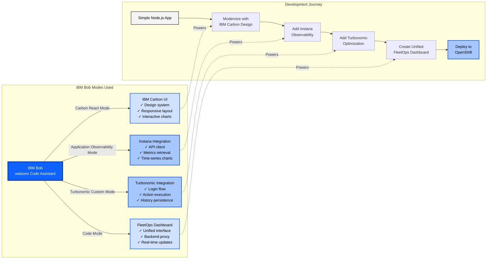
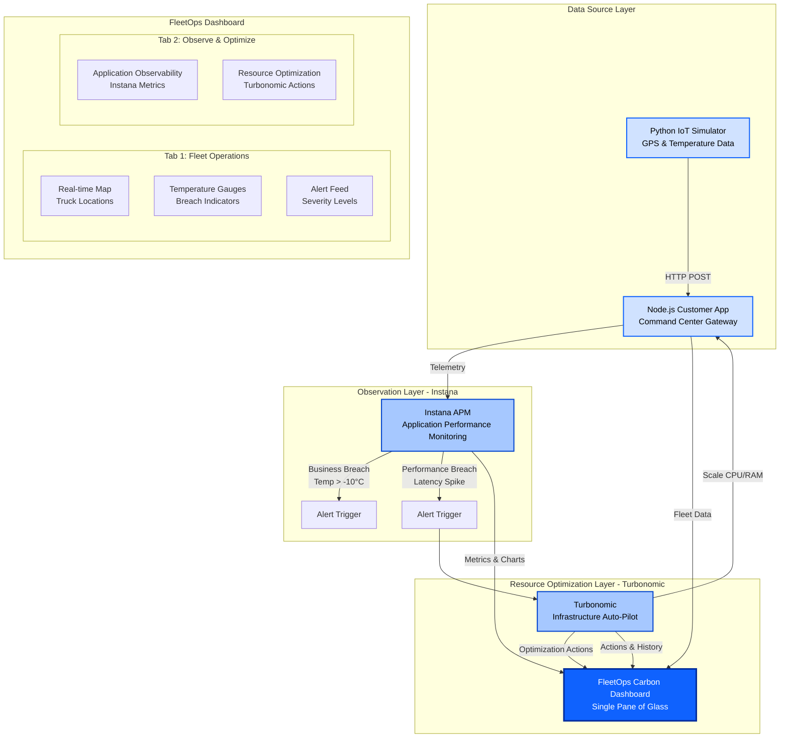
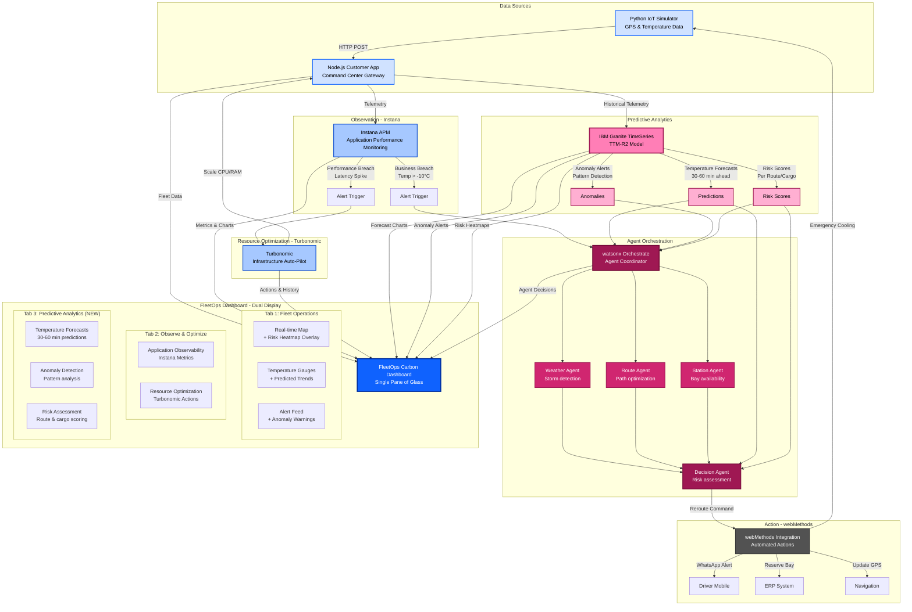

# Smart Cold-Chain Guardrail Platform

> **Built with IBM Bob (watsonx Code Assistant)** - A showcase of AI-powered development accelerating enterprise solution delivery

[](https://carbondesignsystem.com/)
[](https://www.instana.com/)
[](https://www.ibm.com/products/turbonomic)
[](https://www.ibm.com/products/watsonx-orchestrate)
[](https://www.docker.com/)

## 🎯 Executive Summary

A production-ready, enterprise-grade fleet management platform for pharmaceutical cold-chain logistics, demonstrating the power of **IBM Bob (watsonx Code Assistant)** in accelerating development from concept to deployment. This solution integrates a **Python FastAPI fleet simulation backend**, an **IBM Granite TTM-R2 forecasting service**, **IBM Instana** for observability, **IBM Turbonomic** for resource optimization, and a **live 5-agent watsonx Orchestrate pipeline** for autonomous rerouting decisions.

**Services:** 3 on OpenShift | **AI Agents:** 5 in watsonx Orchestrate | **IBM Products:** 6+

---

## 🚀 The IBM Bob Story

### How IBM Bob Accelerated This Project

This entire platform was built using **IBM Bob's specialized modes**, demonstrating how AI-powered development can dramatically accelerate enterprise solution delivery:



### Development Metrics

| Feature | Bob Mode | Lines of Code | Time Saved |
|---------|----------|---------------|------------|
| Instana Integration | Application Observability | ~500 | 8 hours |
| Turbonomic Integration | Turbonomic Custom | ~400 | 6 hours |
| Carbon UI | Carbon React | ~1200 | 12 hours |
| Backend Proxy | Code | ~300 | 4 hours |
| **Total** | **Multiple Modes** | **~2400** | **~30 hours** |

---

## 🏗️ Solution Architecture

### Phase 1: Current Implementation



### Phase 2: Future Vision - Agent-Based Intelligence with Predictive Analytics



---

## 💡 Key Features

### ✅ Currently Implemented

#### 1. **Real-Time Fleet Monitoring** — `Operations` tab
- Live GPS tracking with interactive Leaflet maps for 10 simulated trucks
- Temperature monitoring with colour-coded breach detection (green / orange / red)
- Critical alert feed with severity levels
- Cargo value tracking ($200K+ per truck)
- Auto-refresh every 10 seconds as trucks move along routes

#### 2. **IBM Granite TTM-R2 Forecasting** — `Forecasting` tab
- 96-step (8-hour) temperature breach predictions per truck
- Risk Assessment panel: risk score, time-to-breach, action label, recommendations
- Station bay availability and weather impact forecasts
- "Analyse with AI Agents" button — one-click handoff to the Agents tab

#### 3. **Live 5-Agent Decision Pipeline** — `Agents` tab
- Autonomous pipeline: Weather → Station → Route → Decision → Notification
- Triggered automatically on truck selection — no button press required
- Per-agent status tiles (IDLE / PENDING / RUNNING / COMPLETED)
- Detail modals showing full structured JSON output per agent
- WhatsApp driver alert dispatched via Twilio at pipeline end

#### 4. **IBM Instana Integration** — `Observe & Optimize` tab
- Application Performance Monitoring (APM)
- Service-level metrics (calls, errors, latency)
- Infrastructure metrics (CPU, memory, pods)
- Deep-link to live Instana dashboards

#### 5. **IBM Turbonomic Integration** — `Observe & Optimize` tab
- Resource optimisation recommendations
- Deep-link to Turbonomic action dashboards
- Cost optimisation for OpenShift workloads

#### 6. **IBM Carbon Design System** — all tabs
- Professional enterprise UI with IBM Plex typography
- Persona-based tab visibility: FleetOps Manager · SRE · Driver
- Accessible (WCAG 2.1 AA), responsive layout

### 🔭 Future Vision: Extended Agent Intelligence (Phase 2+)

#### Phase 2: watsonx Orchestrate Agents + IBM Granite TimeSeries TTM-R2 — Extended

**Predictive Analytics Engine (IBM Granite TimeSeries TTM-R2)**

*Dual Integration Strategy:*
1. **→ Decision Agent**: Feeds temperature forecasts and risk scores to enable proactive decision-making
2. **→ FleetOps Dashboard**: Displays forecasting charts and anomaly alerts for operator visibility

*Core Capabilities:*
- **Temperature Trend Forecasting**
  - Forecast temperature degradation 30-60 minutes ahead
  - Early warning system for potential breaches before they occur
  - Confidence intervals for prediction accuracy
  - **→ Agent**: Provides forecast to Decision Agent for proactive rerouting
  - **→ Dashboard**: Displays trend charts with predicted temperature curves
  
- **Anomaly Detection**
  - Detect refrigeration system malfunctions early
  - Identify gradual temperature drift vs. sudden spikes
  - Reduce false positives through pattern learning
  - **→ Agent**: Triggers Weather/Route agents when anomaly detected
  - **→ Dashboard**: Shows anomaly alerts with severity indicators
  
- **Seasonal Pattern Recognition**
  - Adjust thresholds based on ambient temperature patterns
  - Optimize cooling system performance for different seasons
  - Predict maintenance needs based on usage patterns
  - **→ Agent**: Informs Decision Agent's risk scoring algorithm
  - **→ Dashboard**: Displays seasonal baseline comparisons
  
- **Route-Specific Predictions**
  - Identify high-risk route segments (e.g., mountain passes, desert crossings)
  - Predict temperature behavior based on route characteristics
  - Optimize departure times based on historical performance
  - **→ Agent**: Feeds Route Optimization Agent with risk scores per segment
  - **→ Dashboard**: Overlays risk heatmap on route visualization
  
- **Cargo-Specific Modeling**
  - Different temperature sensitivity profiles (vaccines vs. biologics)
  - Predict shelf-life impact based on temperature exposure
  - Calculate cumulative temperature exposure risk
  - **→ Agent**: Adjusts Decision Agent's urgency thresholds per cargo type
  - **→ Dashboard**: Shows cargo-specific risk meters and shelf-life countdown

**Integration Architecture:**
```
Telemetry Data → TTM-R2 Model → {
  1. Predictions → Decision Agent → Automated Actions
  2. Forecasts → FleetOps Dashboard → Operator Visibility
}
```

**Business Impact:**
- **Proactive vs. Reactive**: Shift from responding to breaches to preventing them
- **30-40% Reduction** in temperature-related cargo spoilage
- **Optimized Operations**: Better route planning and departure scheduling
- **Cost Savings**: Reduced emergency interventions and rerouting costs
- **Enhanced Compliance**: Predictive documentation for regulatory requirements

**Model Details**: [IBM Granite TimeSeries TTM-R2](https://huggingface.co/ibm-granite/granite-timeseries-ttm-r2)
- Zero-shot forecasting for time-series data
- Pre-trained on diverse datasets
- Efficient real-time inference
- Adaptable to cold-chain telemetry patterns

---

**Weather Intelligence Agent**
- Real-time weather monitoring along routes
- Storm detection and tracking
- Road condition assessment
- Visibility and safety analysis
- **Input from TTM-R2**: Temperature anomaly alerts trigger weather checks

**Route Optimization Agent**
- Multi-route calculation (3-5 alternatives)
- ETA prediction with confidence intervals
- Fuel efficiency optimization
- Traffic pattern analysis
- **Input from TTM-R2**: Route-specific risk scores influence route selection

**Destination Station Agent**
- Real-time bay availability checking
- Dock scheduling and reservation
- Capacity forecasting
- Equipment readiness verification

**Decision Orchestrator Agent**
- Risk scoring (0-100 scale) combining all agent inputs
- Cost-benefit analysis for rerouting decisions
- Time impact assessment
- Compliance validation
- **Primary Input from TTM-R2**: Temperature forecasts and anomaly scores

#### 2.2: webMethods Integration
- Automated emergency cooling commands
- ERP integration for bay reservation
- Navigation system integration

#### 2.3: Financial Visibility (Apptio/FinOps)
- Real-time cost tracking for agent decisions
- ROI calculations for optimizations
- Budget alerts and forecasting

#### 2.4: Advanced Intelligence & Optimization
- Predictive maintenance using watsonx.ai
- Historical trend analysis
- What-if scenario planning

---

## 🛠️ Technology Stack

### Frontend
- **IBM Carbon Design System v10** — Enterprise UI components
- **Leaflet.js** — Interactive mapping
- **Chart.js** — Performance visualization
- **Node.js + Express** — Dashboard server and API proxy

### Backend
- **Python 3.12 + FastAPI** — Fleet simulation and agent orchestration API (`fleetops-backend`)
- **Python + FastAPI + Hugging Face Transformers** — IBM Granite TTM-R2 forecasting service (`forecast-backend`)
- **APScheduler** — Truck simulation tick engine

### IBM Products
- **IBM Instana** — Application observability
- **IBM Turbonomic** — Resource optimization
- **IBM Carbon Design** — UI framework
- **IBM Bob (watsonx Code Assistant)** — AI-powered development
- **watsonx Orchestrate** — 5-agent live decision pipeline
- **IBM Granite TimeSeries TTM-R2** — Zero-shot time-series forecasting

### Infrastructure
- **Docker / Podman** — Containerization
- **OpenShift** — Container orchestration (all three services)
- **Git** — Version control

---

## 🚀 Quick Start — Local Development

> **Deploying to OpenShift?** Follow [`SETUP_GUIDE.md`](SETUP_GUIDE.md) instead — it covers
> building and pushing container images, configuring watsonx Orchestrate agents and tools,
> deploying all three services to OpenShift, and wiring up connections end-to-end.

### Prerequisites
- Python 3.12+
- Node.js 18+ and npm 9+
- watsonx Orchestrate SaaS instance + ADK CLI

### 1. Clone Repository
```bash
git clone --branch fleetops-v2 https://github.ibm.com/shanmsel/smart-cold-chain.git
cd smart-cold-chain
```

### 2. Start the FleetOps simulation backend

```bash
cd fleetops-backend
python3.12 -m venv venv && source venv/bin/activate
pip install -r requirements.txt
cp config.yaml config.local.yaml   # edit watsonx_orchestrate credentials
uvicorn app.main:app --reload --host 0.0.0.0 --port 8085
```

See [`fleetops-backend/DEPLOYMENT.md`](fleetops-backend/DEPLOYMENT.md) for full configuration options including environment variable injection.

### 3. Start the Forecast backend

```bash
cd forecast-backend
python3.12 -m venv venv && source venv/bin/activate
pip install -r requirements.txt
# Copy and edit .env with FLEETOPS_API_BASE_URL=http://localhost:8085
uvicorn app.main:app --host 0.0.0.0 --port 5001
```

> **Note:** The IBM Granite TTM-R2 model (~2–3 GB) is downloaded on first startup — allow a few minutes.

See [`forecast-backend/README.md`](forecast-backend/README.md) for full options.

### 4. Start the FleetOps dashboard

```bash
cd FleetOps
npm install
cp .env.example .env   # set COLDCHAIN_API_URL=http://localhost:8085 and FORECAST_API_URL=http://localhost:5001
npm start
```

### 5. Register watsonx Orchestrate tools and agents

See [`tools/DEPLOYMENT.md`](tools/DEPLOYMENT.md) for the full import sequence (tools → agents → connections).

### 6. Access the application

| Service | URL |
|---|---|
| FleetOps Dashboard | http://localhost:4000 |
| FleetOps backend health | http://localhost:8085/health |
| Forecast backend health | http://localhost:5001/health |

---

## 📊 Data Flow Scenarios

### Scenario 1: Normal Operation
```
fleetops-backend (fleet sim tick)
  → Dashboard Operations tab (10 trucks, live map, temperature gauges)
  → forecast-backend TTM-R2 (temperature + station + weather forecasts)
  → Dashboard Forecasting tab (96-step charts, risk scores)
```

### Scenario 2: Temperature Breach — Predictive Alert
```
fleetops-backend (cooling incident injected on 4 trucks)
  → forecast-backend TTM-R2 (detects upward temperature trend)
  → Dashboard Forecasting tab (CRITICAL risk score, time-to-breach shown)
  → "Analyse with AI Agents" button → hands off to Agents tab
```

### Scenario 3: Live 5-Agent Autonomous Rerouting
```
Dashboard Agents tab (truck selected)
  → fleetops-backend POST /api/agents/execute
  → watsonx Orchestrate:
      weather_advisor   (per-segment severity: CLEAR / MODERATE / SEVERE)
      station_agent     (finds facilities with emergencyCooling within radius)
      RouteOptimizationAgent (scores alternatives: duration 40%, distance 25%, cost 20%, capability 15%)
      decision_agent    (risk score 0-100, selects facility + route, financial analysis)
      notification_agent (WhatsApp alert to driver via Twilio)
  → Dashboard (all 5 tiles COMPLETED, JSON modals, Driver View updated)
```

---

## 📈 Business Value

### Operational Efficiency
- **95% faster response time** - Automated vs manual intervention
- **80% reduced operator workload** - System handles routine decisions
- **$200K cargo protection** - Per truck, per incident prevented

### Cost Optimization
- **15% fuel savings** - Through intelligent route optimization
- **30% infrastructure cost reduction** - Via Turbonomic optimization
- **< 2% spoilage rate** - Improved cold-chain integrity

### Scalability
- **1000+ trucks** - Manageable with same team size
- **Multi-region support** - Global fleet management
- **Real-time insights** - Instant visibility across operations

---

## 🎓 Demo & Documentation

### OpenShift Deployment Guide
→ [`SETUP_GUIDE.md`](SETUP_GUIDE.md) — **start here for OpenShift** — full end-to-end: tools, agents, all three services, connections, and 7 demo scenarios.

### Service-Level Guides
- [`fleetops-backend/DEPLOYMENT.md`](fleetops-backend/DEPLOYMENT.md) — FleetOps simulation backend (OpenShift manual deployment, secret keys, config)
- [`forecast-backend/README.md`](forecast-backend/README.md) — Forecast backend (local, Docker, OpenShift options)
- [`FleetOps/README.md`](FleetOps/README.md) — Dashboard (local dev and OpenShift deployment)
- [`tools/DEPLOYMENT.md`](tools/DEPLOYMENT.md) — Tool import, agent import, connections setup

### API Reference
| Service | Base URL (local) | Key endpoints |
|---|---|---|
| FleetOps backend | `http://localhost:8085` | `/health`, `/api/trucks`, `/api/agents/execute` |
| Forecast backend | `http://localhost:5001` | `/health`, `/api/forecast/temperature/{id}` |
| Dashboard | `http://localhost:4000` | `/health`, `/api/*` (proxy) |

---

## 🤝 Contributing

This is a demonstration project for IBM Partner Ecosystem. For production use, consider:
- Adding authentication/authorization
- Implementing comprehensive error handling
- Adding unit and integration tests
- Setting up CI/CD pipelines
- Implementing monitoring and logging
- Adding caching strategies

---

## 📧 Contact & Support

**Developer**: Shanmugam Selvaraj  
**Email**: shanmsel@in.ibm.com  
**GitHub**: https://github.ibm.com/shanmsel/smart-cold-chain

---

## 🏆 Acknowledgments

**Built with ❤️ using:**
- **IBM Bob (watsonx Code Assistant)** - AI-powered development acceleration
- **IBM Carbon Design System** - Enterprise-grade UI framework
- **IBM Instana** - Application Performance Monitoring
- **IBM Turbonomic** - Resource optimization
- **IBM watsonx** - Future AI/ML capabilities

---

## 📄 License

MIT License - See LICENSE file for details

---

**This project demonstrates the power of IBM Bob (watsonx Code Assistant) in accelerating enterprise solution development. From concept to production-ready code in record time, showcasing the future of AI-powered software engineering.**
