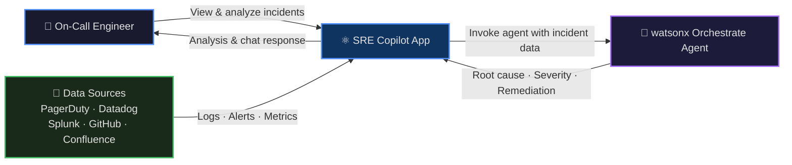

# SRE Copilot — Architecture

```mermaid
graph LR
    USER["👤 On-Call Engineer"]:::user
    APP["⚛️ SRE Copilot App"]:::app
    WXO["🤖 watsonx Orchestrate Agent"]:::wxo
    SOURCES["📡 Data Sources<br/>PagerDuty · Datadog<br/>Splunk · GitHub · Confluence"]:::data

    USER -->|"View & analyze incidents"| APP
    APP -->|"Invoke agent with incident data"| WXO
    WXO -->|"Root cause · Severity · Remediation"| APP
    APP -->|"Analysis & chat response"| USER
    SOURCES -->|"Logs · Alerts · Metrics"| APP

    classDef user   fill:#1a1a2e,stroke:#4f8ef7,stroke-width:2px,color:#e0e0e0
    classDef app    fill:#0f3460,stroke:#4f8ef7,stroke-width:2px,color:#e0e0e0
    classDef wxo    fill:#1c1c3a,stroke:#a56eff,stroke-width:2px,color:#e0e0e0
    classDef data   fill:#1a2a1a,stroke:#42be65,stroke-width:2px,color:#e0e0e0
```
