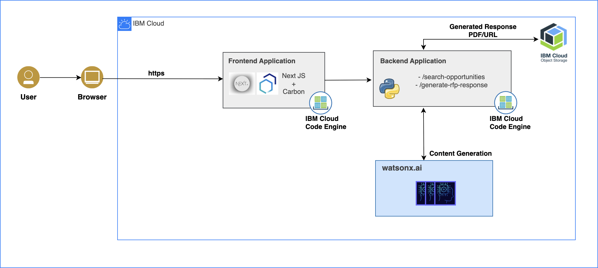
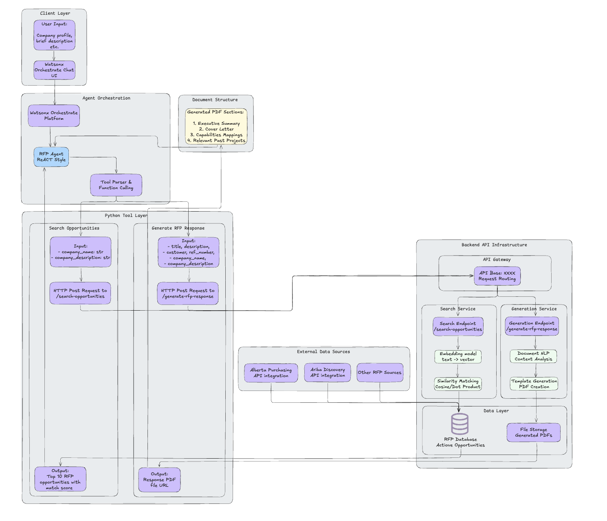

# RFP Assistant - Tender AI

A real-time, production-grade RFP Assistant that helps companies discover, evaluate, and respond to procurement opportunities (Canadian for now).

## Features

- Scrapes opportunities from:
  - [Ariba Discovery](https://portal.us.bn.cloud.ariba.com/discovery/public/leads/search)
  - [Alberta Purchasing Connection](https://purchasing.alberta.ca/search)

- Search & Analyzes opportunity fit 
- Generates RFP drafts: cover letter, executive summary, capabilities mapping etc.
- Real-time orchestration

---
## Demo


---
## High-level Architecture Overview


## Low-level Architecture Overview (with Watsonx Orchestrate)


---
## Tech Stack

- Frontend : NextJS, Carbon Design System
- Backend: FastAPI, IBM Cloud Object Storage (COS)
- AI: IBM watsonx.ai
- Deployment: IBM Code Engine, IBM Container Registry (ICR)


---
## Project Installation (Backend)

### Prerequisites
- Python3.11+

### Environment setup
Copy the `.env_example` to `.env` and fill in your credentials:
```env
WATSONX_API_KEY=<IBM cloud IAM API key>
API_KEY=<COS api key>
IBM_CLOUD_URL=<IBM cloud url>
PROJECT_ID=<Watsonx project id>
LLM=<your LLM ID>

COS_RESOURCE_CRN=<IBM COS Resource CRN>
COS_ENDPOINT=<IBM COS Endpoint>
COS_BUCKET_NAME=<IBM COS Bucket name>
COS_ACCESS_KEY_ID=<IBM COS Access key id>
COS_SECRET_ACCESS_KEY=<IBM COS Secret access key>

NEXT_PUBLIC_BACKEND_URL=<backend app url>
```

### Local Deployment
1. Backend
```bash
cd backend
python3.11 -m venv venv
source venv/bin/activate
pip install --no-cache-dir -r requirements.txt
uvicorn main:app --reload
```

2. Frontend
```bash
cd frontend
npm install
npm run dev
```

### Docker Deployment
1. Backend
```bash
cd backend
docker build -t rfp-assistant-backend . --load
docker run -d -p 6001:6001 --env-file .env rfp-assistant-backend
```

2. Frontend
```bash
cd frontend
docker build -t rfp-assistant-frontend . --load
docker run -d -p 3000:3000 --env-file .env rfp-assistant-frontend
```

## Example Prompt
```
Company Name: IBM Corp
Company Description: We offer enterprise-grade AI, hybrid cloud, IT services, and consulting solutions to help businesses modernize operations, improve decision-making, and drive innovation
```

## Contact
For any support, contact [ sourav.verma@ibm.com, shivangi.shukla@ibm.com ]