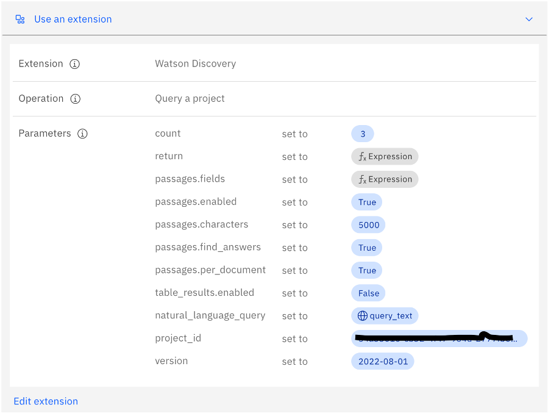
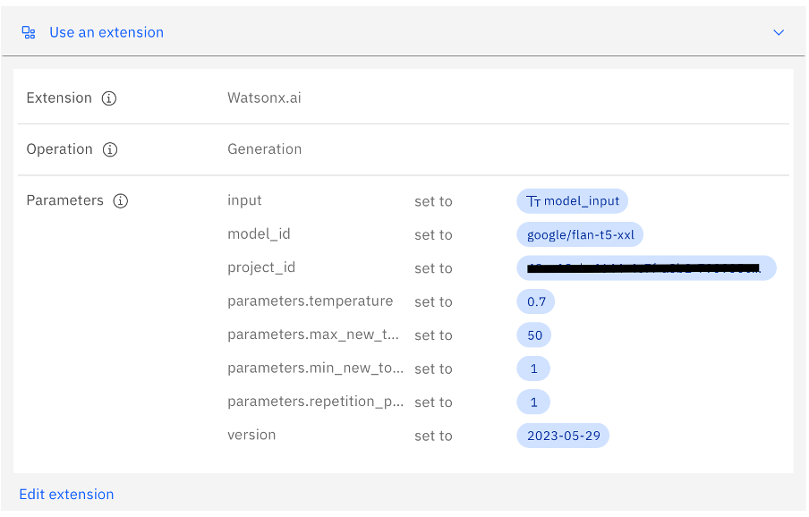

# IBM Smart Procurement Advisor

## Pre-requisites
- 1. Watsonx Discovery on IBM Cloud
- 2. Watsonx.ai on IBM Cloud
- 3. Watsonx Assistant on IBM Cloud
- 4. It is assumed that NodeJS is installed or download from <https://nodejs.org/en/download>.

**1. Setting up watsonx Discovery**

- 1.1	From IBM cloud login search Watsonx Discovery from the catalog.
- 1.2 Create a new instance and launch the application.
- 1.3.	Create a new project, give a suitable name for project and collection.
- 1.4.	Choose document retrieval as the method from drop down list.
- 1.5.	Upload the `Pumpdetails.pdf` file which is available in the files directory.
- 1.6.	Wait for some time until the document is processed.
- 1.7.	In the enrichment tab, under table understanding select table and table contents for entities V2 select table, table understanding and text. In keywords select table and table understanding.
- 1.8.	From the left pane select API integration tab and copy the project ID.
- 1.9.	From the launch page copy the API key and discovery URL which will be useful while setting up the watsonx assistant custom extensions.

The processing will automatically start and the discovery is now setup

**2. Setting up watsonx.ai**
- 2.1.	Log in to IBM cloud
- 2.2.	Search for Watson Machine Learning from the Catalog and create a new instance.(Select region where watsonx.ai is GA )
- 2.3.	From the launch page click on down arrow on launch button and select IBM Watsonx.
- 2.4.	If watsonx.ai is launched for first time please wait until the sandbox project is created. Click on sandbox project and from Manage tab copy the project ID
- 2.4.1	If there has been a previously used watsonx.ai then use the same project ID or in case a new account has been used then make sure right account has been selected and repeat step 4.
- 2.5.	Click on the navigation panel and select IAM console.
- 2.6.	Click on API Key and create a new API key. Save this key for further use.

**3.Steps to create watsonx Assistant**

   - 3.1 In the IBM cloud console, go to **Catalog > watsonx Assistant**
   - 3.2 Fill up the necessary details and click **Create** to create an instance.
   - 3.3 Once instance is created, go to the insatance & click **Launch watsonx Assistant**
   - 3.4 Follow steps **Create New > provide Assistant name > Create assistant**
   - 3.5 In this repo, we have provided `dsce-procurement-action_revised.json` file which will be used in next step.
   - 3.6 From left hand side panel, go to **Actions > Global settings > Switch to Upload/Download tab > from Files directory, Select `dsce-procurement-action_revised.json` > Upload and replace**
   - 3.7 Click on integrations tab and then click on “Build custom Extension“
   - 3.8 Name the first extension as Watson Discovery, upload the **watsonx-openapi.json** file for discovery and then click Next and then Finish.
   - 3.9 Click on Add for same extension and in authentication section select username password. In username type “apikey” and in password paste the key saved in Watson Discovery step.
   - 3.10 In the variables section paste the Watson discovery URL saved in the Watson discovery step.
   - 3.11 Create another extension with name Watsonx.ai by uploading open api spec file for watsonx.ai and click Next and then finish.
   - 3.12 Click on Add for watsonx.ai extension and choose OAuth 2.0 as authentication mechanism. 
   - 3.13 Add api key which was created in watsonx.ai step
   - 3.14 Click on Finish
   - 3.15 Click on actions tab
   - 3.16 Click on search action and edit the custom extension with the variables as shown in the image below and update project ID for Watson Discovery as saved in Watson discovery step.

   

   - 3.17 Select Invoke Watsonx and edit extension with all parameters as shown in the image below. In project ID use the one  for watsonx.ai which was saved in watsonx,ai step.

   


## 4. Setting up and launching the application

- Download the application or maybe a git clone.

- In the project directory, 
 refer to src/components/ and then you will find the watsonxVariables.js

 **Enter your watsonx assistant variables there**

 ```javascript

 const watsonxIntegrationID = "278xxxxxxxxxxxcb8296e";//use your integrationID of watsonx assistant
const watsonxRegion = "us-south";//use your region of watsonx assistant
const watsonxServiceInstanceID = "fc31xxxxxxxxxd711a9";//use your serviceInstanceID of watsonx assistant

export {watsonxIntegrationID, watsonxRegion, watsonxServiceInstanceID};

```

Now, you can run the application:

### `npm start`

Runs the app in the development mode.\
Open [http://localhost:3000](http://localhost:3000) to view it in your browser.

The page will reload when you make changes.\
You may also see any lint errors in the console.

### `npm test`

Launches the test runner in the interactive watch mode.\

### `npm run build`

Builds the app for production to the `build` folder.\
It correctly bundles React in production mode and optimizes the build for the best performance.

The build is minified and the filenames include the hashes.\
Your app is ready to be deployed!
