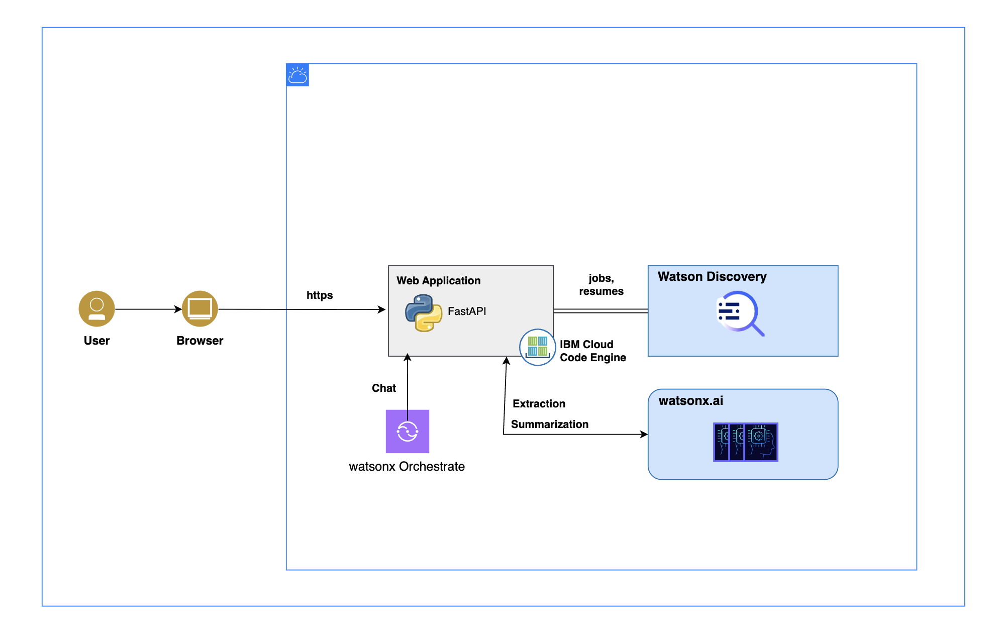
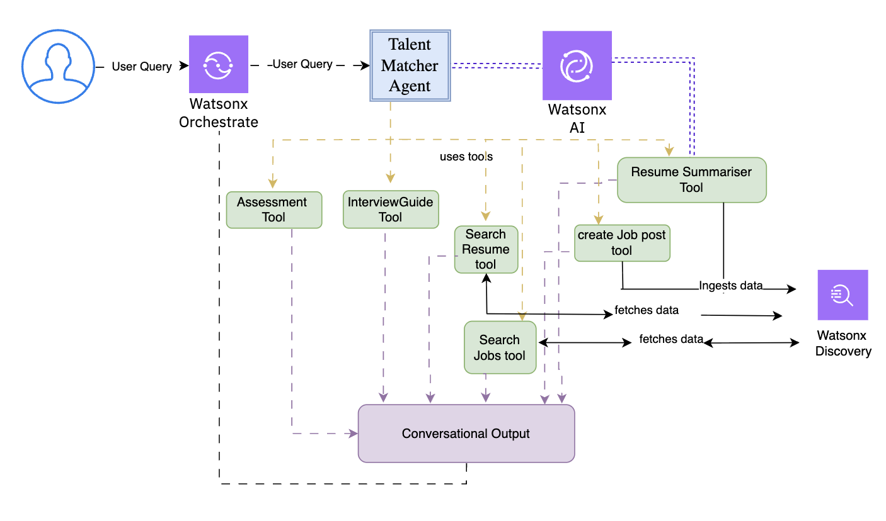

# 🧩 Texas State Bank Talent Matcher API

**A FastAPI microservice for intelligent talent matching powered by IBM Watsonx and Elasticsearch.**
>- High level Architecture
>
>
>- Underlying Endpoints
>

- Check demo at : [Talent Acquistion](./DSCE_UI_Demo.mp4)
---

## 📂 Backend 


```

app/
├── main.py            # FastAPI entry point
├── schemas.py         # Pydantic schemas
├── api/               # API routers (reserved)
├── models/            # Database/ORM models (reserved)
├── services/          # Integrations: Watsonx, Elasticsearch wrappers
└── utils/             # Utilities like logger
data/                    # Raw and processed data files
pyproject.toml           # Dependency manifest managed by uv
requirements.txt         # Compatibility requirements file
.env                     # Environment variables (local, sensitive info)
uv.lock                  # uv lockfile for reproducible installs

```

---

### 1. Clone the repo

```bash
git clone <your-repo-url>
cd <your-project-dir>
````

---

### 2. Install `uv` (Python package manager)

The recommended way to install `uv` is via the official install script:

```bash
curl -LsSf https://astral.sh/uv/install.sh | sh
```

This installs `uv` globally, giving you access to fast, reproducible dependency management.

For more details, see the [uv GitHub repo](https://github.com/astral-sh/uv).

---

### 2, Go to backend folder

```bash
cd backend
```

### 3. Install dependencies

Use `uv` to install all dependencies from `requirements.txt` and sync with `pyproject.toml`:

```bash
uv pip install -r requirements.txt
```

Or to fully synchronize your environment with `pyproject.toml` (recommended after changes):

```bash
uv sync
```

---

### 4. Configure environment variables

Copy the sample `.env.example` to `.env` and update it with your credentials:

```bash
WATSONX_ENDPOINT=https://...
IBM_CLOUD_API_KEY=your_api_key_here
WATSONX_PROJECT_ID=your_project_id_here

ELASTIC_URL=localhost:9200
ELASTIC_USERNAME=elastic
ELASTIC_PASSWORD=changeme
```

---

### 5. Run the FastAPI app locally

Start the development server with hot reload:

```bash
uvicorn main:app --reload
```

* Open your browser at [http://127.0.0.1:8000](http://127.0.0.1:8000)
* Interactive API docs available at [http://127.0.0.1:8000/docs](http://127.0.0.1:8000/docs)


For elasticsearch to work you must call this endpoint

```bash
curl -X POST http://localhost:8000/setup/elasticsearch \
  -H "Content-Type: application/json" \
  -H "Authorization: Bearer <YOUR_TOKEN>" \
  -d '{
    "setup_model": false,
    "indices": [
      {"name": "resumes-index", "recreate": true},
      {"name": "jobs", "recreate": true}
    ]
  }'
```
---

### 🛠️ Development Notes

* API routes and request/response schemas are primarily in `backend/main.py` and `backend/schemas.py`
* Business logic and external integrations live in `backend/services/`
* Elasticsearch wrapper: `backend/services/elastic_wrapper.py`
* IBM Watsonx AI wrapper: `backend/services/watsonx_wrapper.py`
* Utilities (e.g., logging) are in `backend/utils/`

---

### 📦 Dependency Management with `uv`

* To add a package and update `pyproject.toml`:

  ```bash
  uv pip install <package-name>
  ```

* To remove a package and update `pyproject.toml`:

  ```bash
  uv pip uninstall <package-name>
  ```

* To synchronize your virtual environment exactly to `pyproject.toml`:

  ```bash
  uv sync
  ```

---


## Orchestrate setup

- Create a new Agent with the title, description and behaviour given in [Orchestrate Agent](./orchestrate_agent.txt)
- change the endpoint url in backend/openapi.json as per the deployed code engine URL.
- Upload the openapi and select all the tools
- set connection to bearer token based
- deploy the agebt set the connection for live envinormnet with the same bearer token config.
- then follow the guide to setup [adk](./adk/instructions.md)
- FOllow it and set credentials for the connection in both live and draft env
- get the embed chat credentials with :

>1. Get the name of the Agent
>```bash
>orchestrate agents list
>```
>2. Get the embed chat credentials snippet 
> ```bash
> orchestrate channels webchat embed > --agent-name=<Agent name here> --env=live 
> ```
From the output of above command save following variables

- VITE_PUBLIC_API_URL="<backend deployed url>"
- VITE_API_TOKEN="<Bearer token here of the backend api>"
- VITE_ORCHESTRATION_ID="<orchestrate orchestration id>"
- VITE_HOST_URL="<orchestrate service instance url>"
- VITE_CRN="<orchestrate instance crn>"
- VITE_AGENT_ID="<orchestrate agent id>"
- VITE_AGENT_ENVIRONMENT_ID="<orchestrate agent environment id>"

## for frontend setup

### Local

- `cd frontend`
- `npm i`
- `cp .env.template .env`
- fill all the .env credentials
- start with `npm run dev`

### Deployment

- make the context directory as frontend and point it to the Dockerfile inside it.
- for the frontend add the host in vite.config.ts as per the deployed url.