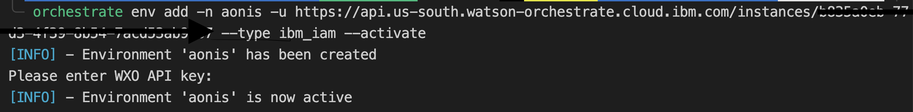
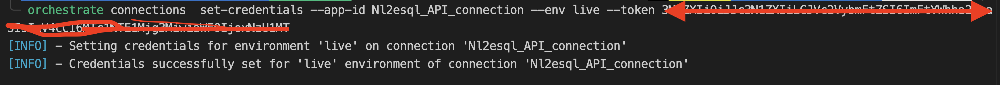

# Orchestrate ADK starter guide

- Please watch this enablement video : https://www.youtube.com/watch?v=CMqckejCnQ4
- Documentation :  https://developer.watson-orchestrate.ibm.com/getting_started/installing#ibm-cloud
- Sample Repo :  https://github.com/erifsx/ibm-watsonx-orchestrate/tree/techzone-workshop-2025

## Prerequisites 

- install uv(recommended), check https://docs.astral.sh/uv/getting-started/installation/

## ADK Setup

1. create venv

```bash
uv venv
```

2. activate venv
```bash
source .venv/bin/activate
```
3. install ADK(Agent development kit) with
```bash
uv pip install ibm-watsonx-orchestrate
```

4. 
- login and get the environement credentilas for the orchestrate instance
- Click on profile, go to settings > API Details
- Copy the service instance URL. and store it somewhere
- Click the Generate API key button.
- Generate an api key, copy and save somewhere securily
- run following command, it will prompt for entering API KEY

```bash
orchestrate env add -n my-name -u https://my-service-instance-url --type ibm_iam --activate
```



- Check the Guide of creating connections here : https://developer.watson-orchestrate.ibm.com/connections/overview

You can create connections via UI, for setting credentials for the connections, the ideal way is to use orchestrate ADK via CLI

- Check existing connections with 

```bash
orchestrate connections list
```

- Then you can set credentials by following commands at this page : https://developer.watson-orchestrate.ibm.com/connections/setting_connections_values

- example to add a bearer token credentials

```bash
orchestrate connections set-credentials --app-id <my_app_id> --env [draft|live] --token <token>
```


remember:

1. The app id is the id of connection or connecting application
2. There are two envinorment avaialble draft or live, so you can connect with a dev envinorment database 
3. The Auth type is upto the developer orchestrate supports basic, bearer, api key, oauth, external identity provider(sso) and even key value, just make sure that the corresponding MCP server or 